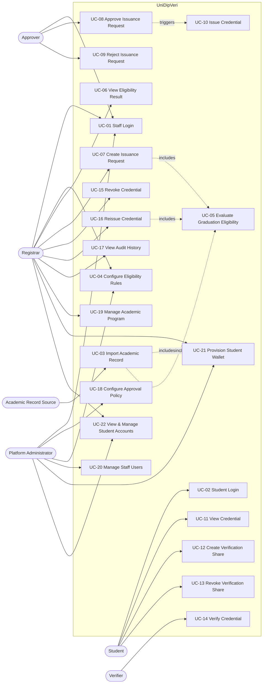

# Use Cases

**Version:** 2.1

Companion to `docs/01-requirements/SRS.md` (v2.2). Each use case is traceable to the functional requirements it implements, so a reviewer can check completeness in both directions. This document is process/interaction detail — it does not introduce new requirements beyond what's in the SRS.

---

## 1. Actors

| Actor                  | Type             | Notes                                                                                     |
| ---------------------- | ---------------- | ----------------------------------------------------------------------------------------- |
| Academic Record Source | External system  | Supplies trusted academic records; not a human user (see SRS AS-01)                       |
| Registrar              | Human, staff     | Views records/students, manages programs/rules, initiates requests, requests wallet retry |
| Approver               | Human, staff     | Approves/rejects pending issuance requests                                                |
| Platform Administrator | Human, staff     | Configures schema, approval policy, manages staff users and roles                         |
| Student / Graduate     | Human            | Views credentials, manages shares                                                         |
| Verifier               | Human, anonymous | Opens a share link, receives a verification result                                        |
| walt.id                | External system  | VC issuance/verification/status and wallet API, invoked via VC adapter / backend          |

## 2. Use Case Diagram

---

## 3. Use Case Specifications

### UC-01 — Staff Login

**Primary actor:** Registrar, Approver, Platform Administrator

**Preconditions:** Actor has a valid staff account with `ACTIVE` status.

**Main success scenario:**

1. Actor submits email and password.
2. System authenticates the credentials.
3. System establishes a session scoped to the actor's role(s).

**Extensions:**

- 2a. Invalid credentials or deactivated account → system rejects login, no session is created.

**Postconditions:** Actor is authenticated; role-based access applies to all subsequent actions.

**Related requirements:** FR-AUTH-01, FR-AUTH-02, FR-AUTH-04

### UC-02 — Student Login

**Primary actor:** Student

**Main success scenario:** Same shape as UC-01, scoped to a student session.

**Postconditions:** Student may only view their own credentials, shares, and verification events.

**Related requirements:** FR-AUTH-03, FR-STU-04

### UC-03 — Import Academic Record

**Primary actor:** Academic Record Source

**Preconditions:** The source system holds an authoritative record for a student.

**Main success scenario:**

1. Source system submits a student's academic record (identity, program, credits, GPA, completed courses) to the system.
2. System creates or updates the `STUDENT` and `ACADEMIC_RECORD` entries, treating the payload as correct on import.
3. System triggers UC-21 (Provision Student Wallet) if the student does not have an active wallet.
4. System triggers UC-05 (Evaluate Graduation Eligibility) for the affected student/program.

**Extensions:**

- 2a. Payload references an unknown program → import is rejected; source system is notified.

**Postconditions:** Student/academic data reflects the source system's latest submission; a wallet is provisioned; an eligibility evaluation exists or is refreshed.

**Related requirements:** FR-STU-01–03, FR-ELIG-01–02, FR-WAL-01, AS-01, FR-AUD-07

**Note:** No human actor edits academic data directly — see SRS 2.1 and Architecture_Design.md Section 2.

### UC-04 — Configure Eligibility Rules

**Primary actor:** Registrar (or Platform Administrator)

**Preconditions:** Program exists.

**Main success scenario:**

1. Actor opens a program's eligibility rules.
2. Actor defines/edits rules (minimum credits, minimum GPA, required courses, etc.).
3. System saves the rules as a new versioned rule set.

**Postconditions:** Future eligibility evaluations for this program use the new rule set; past evaluations remain linked to the version they used.

**Related requirements:** FR-PROG-03, FR-PROG-04, FR-ELIG-04, FR-ELIG-10

### UC-05 — Evaluate Graduation Eligibility

**Primary actor:** System (triggered by UC-03 import, or manually by Registrar)

**Preconditions:** Student has an academic record and a program with an active rule set.

**Main success scenario:**

1. System loads the student's academic record and the program's current rule set.
2. System checks the record against each rule.
3. If all mandatory rules pass, system records result `ELIGIBLE`.
4. System timestamps and stores the evaluation.

**Extensions:**

- 3a. One or more mandatory rules fail → system records `NOT_ELIGIBLE` and lists the failed requirements.

**Postconditions:** Latest eligibility evaluation is available to the Registrar and gates UC-07.

**Related requirements:** FR-ELIG-03–06, FR-ELIG-08, FR-AUD-08

### UC-06 — View Eligibility Result

**Primary actor:** Registrar

**Main success scenario:**

1. Registrar opens a student's record.
2. System displays the latest eligibility evaluation, including failed requirements if `NOT_ELIGIBLE`.

**Related requirements:** FR-ELIG-09

### UC-07 — Create Credential Issuance Request

**Primary actor:** Registrar

**Preconditions:** Student's latest eligibility evaluation is `ELIGIBLE`, and student has an `ACTIVE` provisioned wallet.

**Main success scenario:**

1. Registrar selects an eligible student and initiates issuance.
2. System verifies active wallet status (UC-21).
3. System creates a `CREDENTIAL_ISSUANCE_REQUEST` in `PENDING_APPROVAL`, linked to the qualifying evaluation.
4. Request becomes visible to Approvers (UC-08/UC-09).

**Extensions:**

- 1a. Student's latest evaluation is `NOT_ELIGIBLE` → system refuses to create the request and shows the failed requirements.
- 1b. Student has no active wallet (`PENDING` or `FAILED`) → system prompts Registrar to provision/retry student wallet.
- 1c. A pending or already-issued (non-superseded) request already exists for this student/credential type → system refuses duplicate creation.

**Postconditions:** A request awaits approval, or was rejected at creation for ineligibility.

**Related requirements:** FR-APPR-01, FR-APPR-02, FR-CRED-06, FR-WAL-04

### UC-08 — Approve Credential Issuance Request

**Primary actor:** Approver

**Preconditions:** Request is `PENDING_APPROVAL`; actor has not already decided on this request.

**Main success scenario:**

1. Approver reviews a pending request.
2. Approver approves, optionally with a comment.
3. System records the decision.
4. If the approval count now meets the policy's required count (1 in the MVP), system triggers UC-10 automatically.

**Postconditions:** Request is one step closer to, or has reached, `ISSUED`.

**Related requirements:** FR-APPR-03–06, FR-APPR-08–09

### UC-09 — Reject Credential Issuance Request

**Primary actor:** Approver

**Preconditions:** Request is `PENDING_APPROVAL`.

**Main success scenario:**

1. Approver reviews a pending request.
2. Approver rejects, with a reason.
3. System sets request status to `REJECTED`.

**Postconditions:** No credential is issued for this request.

**Related requirements:** FR-APPR-07, FR-APPR-08

### UC-10 — Issue Credential

**Primary actor:** System (triggered by UC-08 reaching the required approval count)

**Preconditions:** Request has met its approval policy, and student has an active `wallet_id`.

**Main success scenario:**

1. System loads the credential schema.
2. System builds the credential subject from the request's student/program data.
3. System calls the VC adapter to issue the credential via walt.id into the student's server-managed wallet (`wallet_id`).
4. System stores the resulting `CREDENTIAL` with status `VALID` and marks the request `ISSUED`.

**Extensions:**

- 3a. walt.id issuance call fails → request remains in its last approved state; issuance may be retried; failure is logged.

**Postconditions:** A valid, VC-backed credential exists in the student's server-managed wallet.

**Related requirements:** FR-CRED-01–06, FR-WAL-04

### UC-11 — View Credential

**Primary actor:** Student

**Preconditions:** Student has at least one issued credential.

**Main success scenario:**

1. Student logs in (UC-02).
2. Student opens their credential list.
3. System displays credential details (graduate name, degree, program, field, university, award date, status).

**Related requirements:** FR-CRED-07, FR-CRED-08, FR-STU-04

### UC-12 — Create Verification Share

**Primary actor:** Student

**Preconditions:** Credential status is `VALID`.

**Main success scenario:**

1. Student selects a credential and requests a share link.
2. Student specifies an expiration time (and optionally a purpose label).
3. System generates an opaque share token and returns a public URL.

**Postconditions:** A share exists that a verifier can use until it expires or is revoked.

**Related requirements:** FR-SHARE-01–04

### UC-13 — Revoke Verification Share

**Primary actor:** Student

**Preconditions:** An active share exists.

**Main success scenario:**

1. Student selects an active share.
2. Student revokes it.
3. System marks the share revoked; subsequent verification attempts against it fail.

**Related requirements:** FR-SHARE-06, FR-SHARE-07

### UC-14 — Verify Credential

**Primary actor:** Verifier (anonymous)

**Preconditions:** Verifier has a share URL.

**Main success scenario:**

1. Verifier opens the share URL.
2. System checks the share is active and unexpired.
3. System retrieves the associated credential.
4. System calls walt.id to verify issuer authenticity, integrity, and status against the server-managed wallet entry.
5. System returns a plain-language result (`VERIFIED`, with credential summary fields).

**Extensions:**

- 2a. Share is expired → system returns `EXPIRED_SHARE`.
- 2b. Share is revoked → system treats it as invalid and returns `EXPIRED_SHARE`/an equivalent "not available" result rather than exposing why.
- 3a. Underlying credential is `REVOKED` → system returns `REVOKED`.
- 4a. walt.id cannot confirm issuer or integrity → system returns `UNKNOWN_ISSUER` or `INVALID_CREDENTIAL` as applicable.
- 4b. walt.id call fails (timeout, error) → system returns `VERIFICATION_ERROR`.

**Postconditions:** A `VERIFICATION_EVENT` is recorded regardless of outcome.

**Related requirements:** FR-VER-01–08, FR-AUD-05

**Trust note:** This use case only ever attests to layer-3 credential status (SRS NFR-07); it never implies the underlying academic record or eligibility decision was independently re-checked.

### UC-15 — Revoke Credential

**Primary actor:** Registrar

**Preconditions:** Credential status is `VALID`.

**Main success scenario:**

1. Registrar selects a credential and provides a revocation reason.
2. System calls walt.id to update credential status in the wallet/status registry.
3. System sets the local credential status to `REVOKED` and records the reason, actor, and timestamp.

**Postconditions:** No future verification of this credential returns `VERIFIED`.

**Related requirements:** FR-CRED-09–11

### UC-16 — Reissue Credential

**Primary actor:** Registrar (with Approver)

**Preconditions:** A credential exists in `REVOKED` status.

**Main success scenario:**

1. Registrar initiates reissuance for a revoked credential.
2. System re-runs eligibility evaluation (UC-05) for the student — a past eligible result does not carry over automatically.
3. If eligible, system creates a new issuance request linked via `supersedesCredentialId` and routes it through UC-07–UC-10.
4. Upon issuance, the new credential references the credential it supersedes.

**Extensions:**

- 2a. Student is no longer eligible under current rules → reissuance cannot proceed.

**Related requirements:** FR-CRED-12–13, FR-ELIG-10

### UC-17 — View Audit History

**Primary actor:** Registrar (system-wide), Student (own records only)

**Main success scenario:**

1. Actor opens the relevant audit view.
2. System displays a chronological, timestamped record of the relevant events (import, wallet provisioning, evaluation, request, approval/rejection, issuance, revocation, share activity, verification attempts, user management) scoped to the actor's permissions.

**Related requirements:** FR-AUD-01–10, NFR-06

### UC-18 — Configure Approval Policy

**Primary actor:** Platform Administrator

**Main success scenario:**

1. Administrator opens approval policy settings.
2. Administrator sets the required approval count (ships as 1 in the MVP).
3. System applies the policy to future issuance requests.

**Related requirements:** FR-APPR-10

### UC-19 — Manage Academic Program

**Primary actor:** Registrar

**Main success scenario:**

1. Registrar creates or edits a program (name, degree level, field of study).
2. System stores the program under the single university.

**Related requirements:** FR-PROG-01, FR-PROG-02, FR-UNI-02

### UC-20 — Manage Staff Users

**Primary actor:** Platform Administrator

**Preconditions:** Platform Administrator is authenticated.

**Main success scenario:**

1. Platform Administrator accesses the user management console.
2. Administrator creates a new staff user by providing name, email, password, and selecting one or more roles (`REGISTRAR`, `APPROVER`, `ADMIN`), or edits an existing staff user's role or status.
3. System validates input (unique email, at least one active Admin maintained).
4. System persists the user in `UNIVERSITY_STAFF` with status `ACTIVE`.
5. System logs the user management audit event.

**Extensions:**

- 2a. Admin attempts to deactivate the last remaining active Admin → system rejects action with an error.
- 2b. Email is already registered → system rejects creation with duplicate conflict error.

**Postconditions:** Staff user account is created/updated; the staff member can log in and perform actions matching their assigned role.

**Related requirements:** FR-USER-01, FR-USER-02, FR-USER-03, FR-USER-05, FR-AUD-09

### UC-21 — Provision Student Wallet

**Primary actor:** System (automatic upon UC-03 Import) or Platform Administrator / Registrar (manual retry)

**Preconditions:** Student record exists in the system.

**Main success scenario:**

1. Trigger occurs (student imported without wallet, or staff clicks "Provision / Retry Wallet").
2. System issues a request to walt.id Wallet API to provision a server-managed custodial wallet for the student.
3. walt.id returns a unique `wallet_id` and associated cryptographic keys/DID.
4. System associates `wallet_id` with `STUDENT` and sets `wallet_status` to `ACTIVE`.
5. System logs the wallet provisioning audit event.

**Extensions:**

- 3a. walt.id Wallet API call fails or times out → system records `wallet_status` as `FAILED`, logs the error, and keeps student record intact for later retry.

**Postconditions:** Student record contains an active `wallet_id` enabling credential issuance.

**Related requirements:** FR-WAL-01, FR-WAL-02, FR-WAL-03, FR-WAL-04, FR-AUD-10

### UC-22 — View & Manage Student Accounts

**Primary actor:** Registrar, Platform Administrator

**Preconditions:** Actor is authenticated as Registrar or Platform Administrator.

**Main success scenario:**

1. Staff user opens the Student Management list.
2. System displays registered students, including student number, name, email, enrolled program, enrollment status (`ACTIVE`, `GRADUATED`, `INACTIVE`), and wallet status (`ACTIVE`, `PENDING`, `FAILED`).
3. Staff user can filter/search students and view detailed student profiles, linked academic records, eligibility evaluations, and credentials.

**Postconditions:** Staff user has full visibility into student account state and wallet readiness.

**Related requirements:** FR-USER-04, FR-STU-02, FR-STU-03, FR-WAL-03

---

## 4. Traceability Summary

| SRS Area                         | Covering Use Cases         |
| -------------------------------- | -------------------------- |
| Authentication (4.1)             | UC-01, UC-02               |
| University Configuration (4.2)   | UC-18, UC-19               |
| Program Management (4.3)         | UC-04, UC-19               |
| Student Management (4.4)         | UC-03, UC-22               |
| Eligibility (4.5)                | UC-03, UC-04, UC-05, UC-06 |
| Approval Workflow (4.6)          | UC-07, UC-08, UC-09, UC-18 |
| Credential Issuance (4.7)        | UC-10                      |
| Credential Viewing (4.8)         | UC-11                      |
| Credential Revocation (4.9)      | UC-15                      |
| Credential Reissuance (4.10)     | UC-16                      |
| Credential Sharing (4.11)        | UC-12, UC-13               |
| Public Verification (4.12)       | UC-14                      |
| Audit Logging (4.13)             | UC-17                      |
| User Management (4.14)           | UC-20, UC-22               |
| Student Wallet Management (4.15) | UC-21, UC-03, UC-07, UC-10 |

Every SRS functional requirement area maps to at least one use case above; no use case introduces behavior not already required by the SRS.
