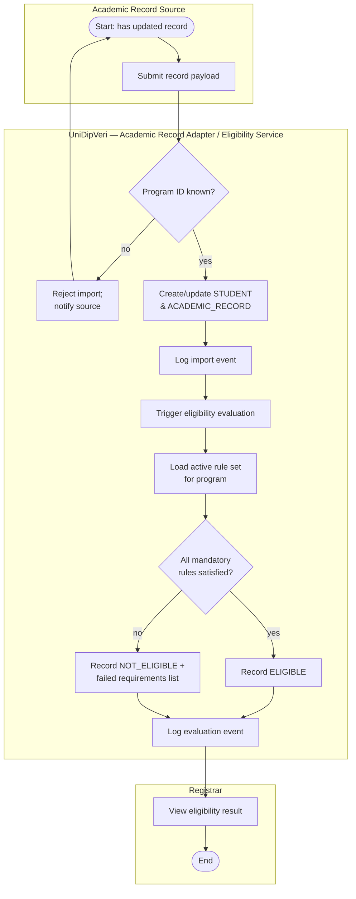
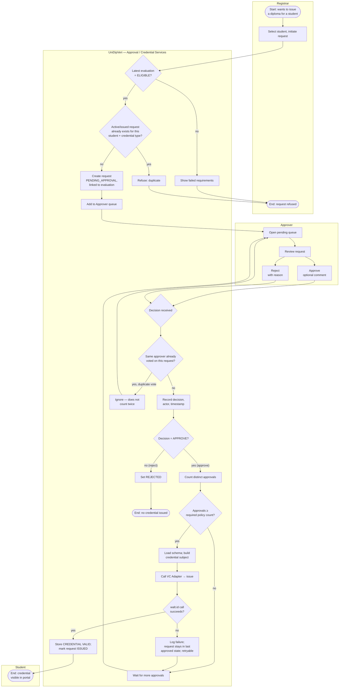
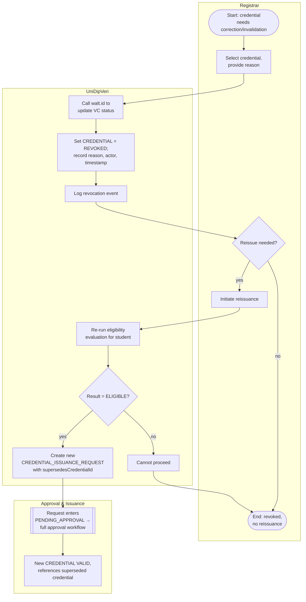
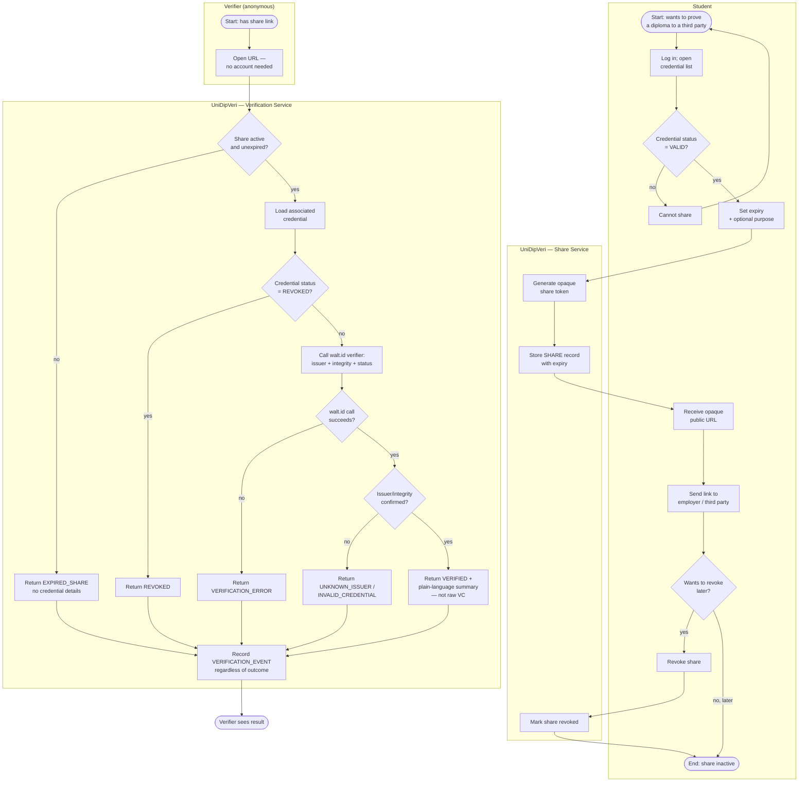

# Activity Diagrams — UniDipVeri

**Version:** 2.0

Companion to `docs/01-requirements/SRS.md` (v2.0), `docs/01-requirements/Use_Cases.md`, and `docs/02-analysis/DFD.md`. Where the DFD shows data at rest and in motion, these diagrams show control flow and decision points over time for the workflows that matter most to the thesis's central contribution (the eligibility-gated, approval-gated issuance pipeline) and its payoff (public verification). Swimlanes are actors/system components; diamonds are decisions; each diagram is traced back to the use case(s) and requirement(s) it implements.

---

## 1. Import Academic Record → Eligibility Evaluation

**Traces to:** UC-03, UC-05 · FR-STU-01–03, FR-ELIG-01–08, AS-01

**Notes**

- This flow can also start from **Registrar → manual re-evaluate** (UC-05 primary actor note); in that case the swimlane entry point is `B6` directly, skipping `A1`–`B5`.
- `B9`'s failed-requirements list is what US-D2 / FR-ELIG-09 surfaces to the Registrar in `C1`.

---

## 2. Credential Issuance Request → Approval → Issuance

**Traces to:** UC-07, UC-08, UC-09, UC-10 · FR-APPR-01–10, FR-CRED-01–06

**Notes**

- `C4` implements FR-APPR-09 (no double-counting the same approver).
- `D3`/`D4` implements UC-10's extension: a failed walt.id call does not corrupt request state — it stays at "fully approved, not yet issued" and can be retried.
- The MVP policy (`B8`/`C8` threshold) is N = 1, but the flow is drawn generically since N is Admin-configurable (FR-APPR-10, US-E5).

---

## 3. Credential Revocation → Reissuance

**Traces to:** UC-15, UC-16 · FR-CRED-09–13, FR-ELIG-10

**Notes**

- `B4`/`B5` is the enforcement point for FR-ELIG-10 and the reissuance extension in UC-16: a student's _past_ eligibility never carries over automatically — reissuance is treated as a brand-new issuance request, re-evaluated and re-approved from scratch (folds into Diagram 2 at `C1`).

---

## 4. Share Creation → Public Verification

**Traces to:** UC-11, UC-12, UC-13, UC-14 · FR-SHARE-01–07, FR-VER-01–08, NFR-02, NFR-07

**Notes**

- `C11` deliberately never claims to re-check academic performance (US-H4, NFR-07, AC-11) — it is scoped to layer-3 credential status only.
- A revoked _share_ (`C1` = no) and a revoked _credential_ (`C4` = yes) are distinguished internally but, per Use_Cases.md UC-14 extension 2b, a revoked share is surfaced to the verifier the same way as an expired one rather than leaking which case applied.
- `C12` fires on every branch — this is what backs FR-AUD-05 and US-I2 (student sees full verification-event history regardless of outcome).

---

## 5. Diagram Cross-Reference

| Diagram                          | Use Cases                  | Key Requirements                             | Actors/Lanes                              |
| -------------------------------- | -------------------------- | -------------------------------------------- | ----------------------------------------- |
| 1. Import → Eligibility          | UC-03, UC-05               | FR-STU-01–03, FR-ELIG-01–08, AS-01           | Academic Record Source, System, Registrar |
| 2. Request → Approval → Issuance | UC-07, UC-08, UC-09, UC-10 | FR-APPR-01–10, FR-CRED-01–06                 | Registrar, System, Approver, Student      |
| 3. Revocation → Reissuance       | UC-15, UC-16               | FR-CRED-09–13, FR-ELIG-10                    | Registrar, System, (folds into Diagram 2) |
| 4. Share → Verification          | UC-11, UC-12, UC-13, UC-14 | FR-SHARE-01–07, FR-VER-01–08, NFR-02, NFR-07 | Student, System, Verifier                 |

Together, Diagrams 1–4 cover the full NFR-06 traceability chain end to end: _Academic Record Imported → Eligibility Evaluated → (Eligible → Issuance Requested → Approved → Issued) or (Not Eligible → No Issuance) → [Revoked → Reissued] → Shared → Verified._
