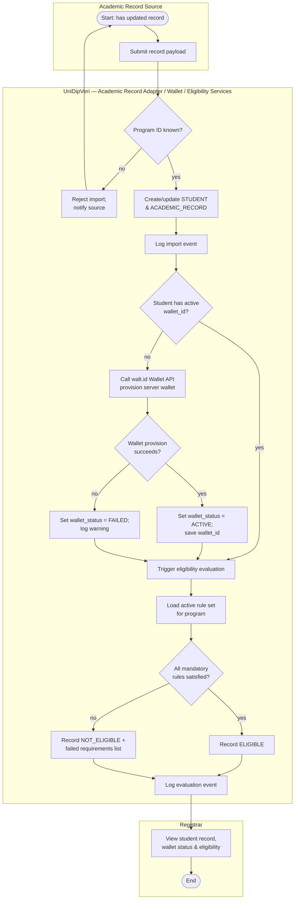
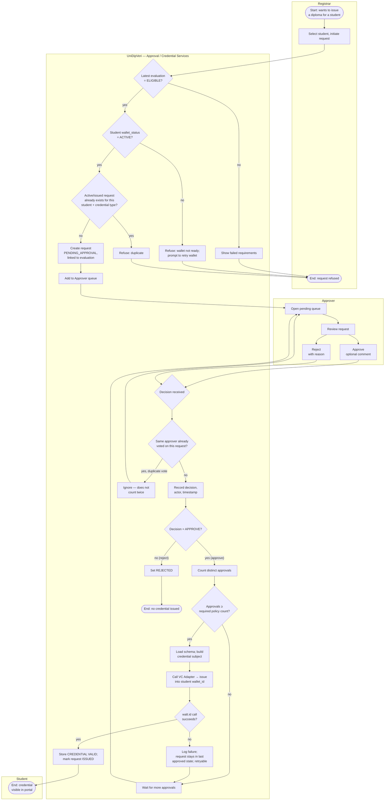
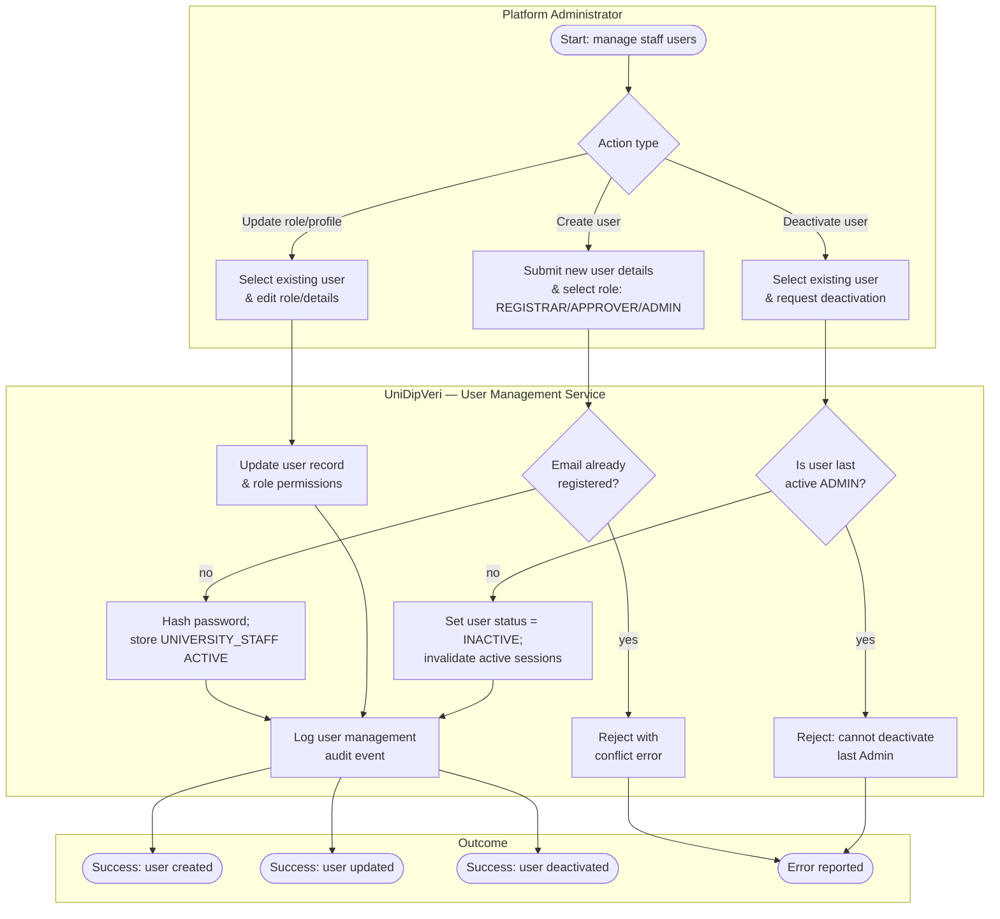
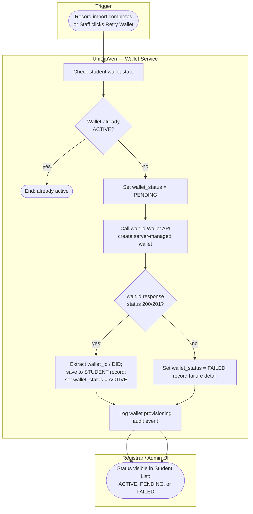

# Activity Diagrams — UniDipVeri

**Version:** 0.1.0

Companion to `docs/01-requirements/SRS.md`, `docs/01-requirements/Use_Cases.md`, and `docs/02-analysis/DFD.md`. Where the DFD shows data at rest and in motion, these diagrams show control flow and decision points over time for the workflows that matter most to the thesis's central contribution (the eligibility-gated, approval-gated issuance pipeline), its user and wallet foundation, and its payoff (public verification). Swimlanes are actors/system components; diamonds are decisions; each diagram is traced back to the use case(s) and requirement(s) it implements.

---

## 1. Import Academic Record → Wallet Provisioning & Eligibility Evaluation

**Traces to:** UC-03, UC-05, UC-21 · FR-STU-01–03, FR-ELIG-01–08, FR-WAL-01, AS-01

**Notes**

- This flow can also start from **Registrar → manual re-evaluate** (UC-05 primary actor note); in that case the swimlane entry point is `B6` directly, skipping `A1`–`B5`.
- `B9`'s failed-requirements list is what US-D2 / FR-ELIG-09 surfaces to the Registrar in `C1`.
- `BW2`–`BW5` provisions the server-managed custodial wallet identity automatically without blocking the import if walt.id is transiently unreachable.

---

## 2. Credential Issuance Request → Approval → Issuance

**Traces to:** UC-07, UC-08, UC-09, UC-10, UC-21 · FR-APPR-01–10, FR-CRED-01–06, FR-WAL-04

**Notes**

- `BW` enforces FR-WAL-04: an active custodial wallet must be provisioned before issuance can proceed.
- `C4` implements FR-APPR-09 (no double-counting the same approver).
- `D3`/`D4` implements UC-10's extension: a failed walt.id call does not corrupt request state — it stays at "fully approved, not yet issued" and can be retried.
- The MVP policy (`B8`/`C8` threshold) is N = 1, but the flow is drawn generically since N is Admin-configurable (FR-APPR-10, US-E5).

---

## 3. Credential Revocation → Reissuance

**Traces to:** UC-15, UC-16 · FR-CRED-09–13, FR-ELIG-10

**Notes**

- `B4`/`B5` is the enforcement point for FR-ELIG-10 and the reissuance extension in UC-16: a student's _past_ eligibility never carries over automatically — reissuance is treated as a brand-new issuance request, re-evaluated and re-approved from scratch (folds into Diagram 2 at `C1`).

---

## 4. Share Creation → Public Verification

**Traces to:** UC-11, UC-12, UC-13, UC-14 · FR-SHARE-01–07, FR-VER-01–08, NFR-02, NFR-07

---

## 5. Staff User Management & Role Assignment

**Traces to:** UC-20 · FR-USER-01, FR-USER-02, FR-USER-03, FR-USER-05, FR-AUD-09

---

## 6. Student Wallet Provisioning & Retry

**Traces to:** UC-21, UC-22 · FR-WAL-01, FR-WAL-02, FR-WAL-03, FR-AUD-10

---

## 7. Diagram Cross-Reference

| Diagram                                | Use Cases                         | Key Requirements                               | Actors/Lanes                              |
| -------------------------------------- | --------------------------------- | ---------------------------------------------- | ----------------------------------------- |
| 1. Import → Wallet → Eligibility       | UC-03, UC-05, UC-21               | FR-STU-01–03, FR-ELIG-01–08, FR-WAL-01, AS-01  | Academic Record Source, System, Registrar |
| 2. Request → Approval → Issuance       | UC-07, UC-08, UC-09, UC-10, UC-21 | FR-APPR-01–10, FR-CRED-01–06, FR-WAL-04        | Registrar, System, Approver, Student      |
| 3. Revocation → Reissuance             | UC-15, UC-16                      | FR-CRED-09–13, FR-ELIG-10                      | Registrar, System, (folds into Diagram 2) |
| 4. Share → Verification                | UC-11, UC-12, UC-13, UC-14        | FR-SHARE-01–07, FR-VER-01–08, NFR-02, NFR-07   | Student, System, Verifier                 |
| 5. Staff User Management               | UC-20                             | FR-USER-01, FR-USER-02, FR-USER-03, FR-USER-05 | Platform Administrator, System            |
| 6. Student Wallet Provisioning & Retry | UC-21, UC-22                      | FR-WAL-01, FR-WAL-02, FR-WAL-03, FR-WAL-04     | System, Registrar, Platform Administrator |

Together, Diagrams 1–6 cover the full lifecycle and operational prerequisites end to end: _Staff Managed & Roles Assigned → Academic Record Imported → Student Wallet Provisioned → Eligibility Evaluated → (Eligible → Issuance Requested → Approved → Issued to Wallet) or (Not Eligible → No Issuance) → [Revoked → Reissued] → Shared → Verified._
