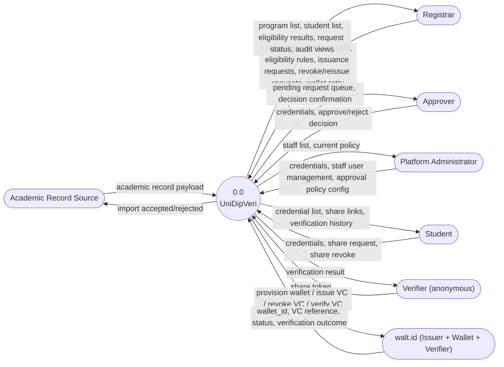
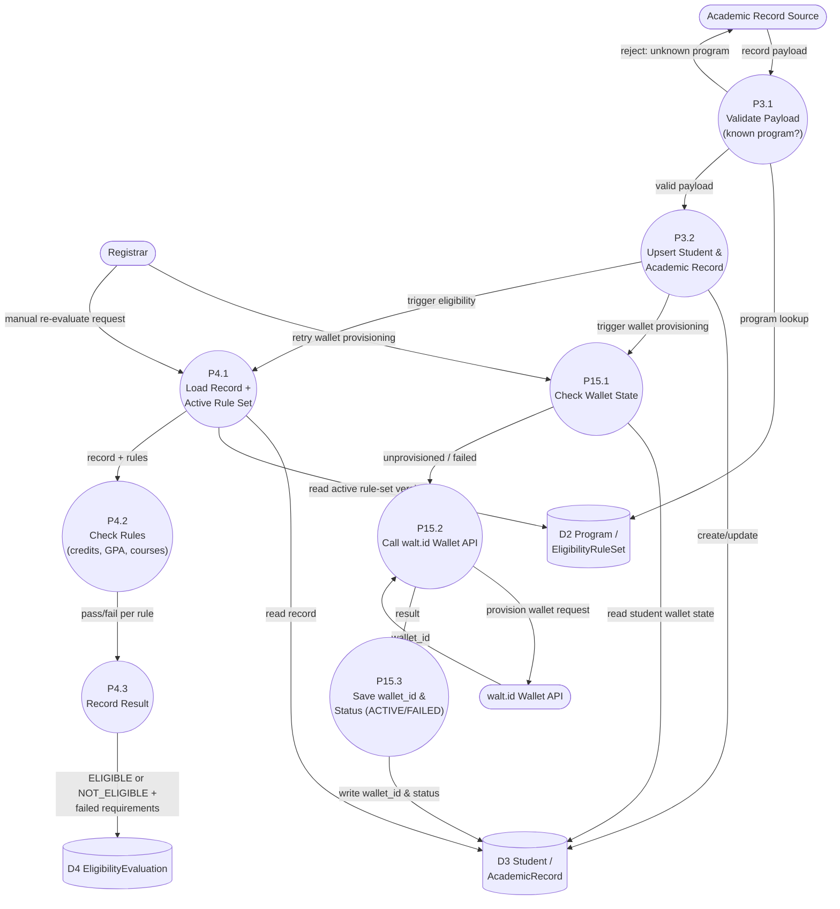
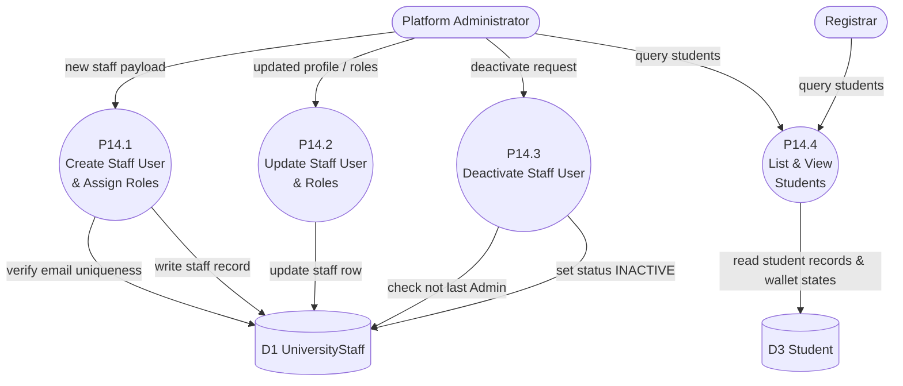
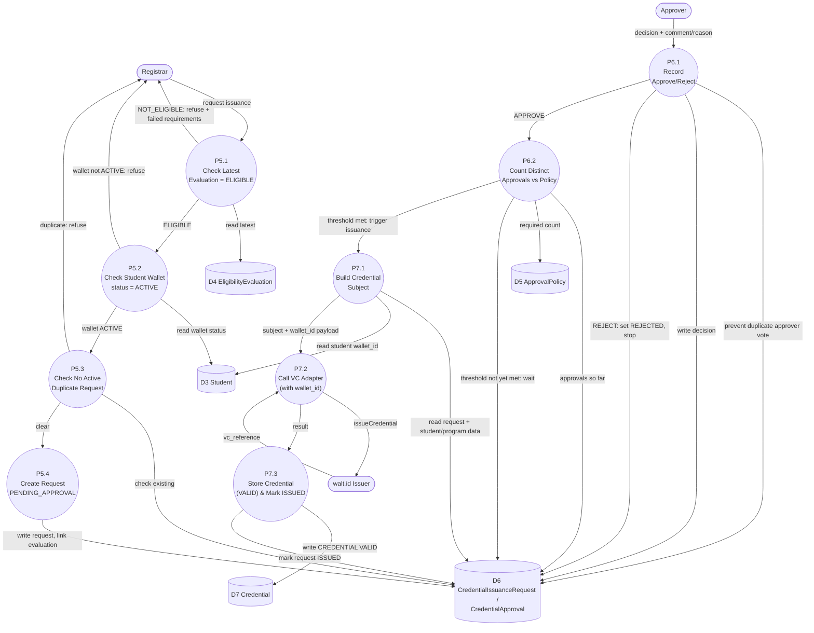
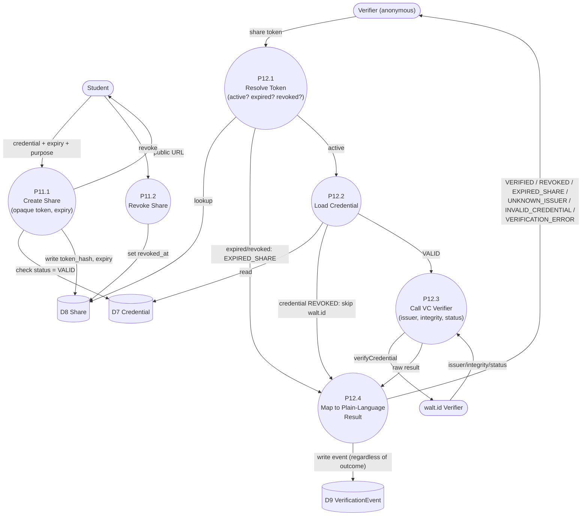

# Data Flow Diagrams — UniDipVeri

**Version:** 2.1

Companion to `docs/01-requirements/SRS.md` (v2.1), `docs/01-requirements/Use_Cases.md`, `docs/03-design/Data_Model.md`, and `docs/03-design/Architecture_Design.md`. This document shows _what data moves where_, complementing the use cases (interaction detail) and the architecture doc (component/layering detail). Notation: external entities are rectangles, processes are rounded/circular nodes numbered `P<n>`, data stores are open-ended boxes numbered `D<n>`, and arrows are labeled data flows. It does not introduce any process, store, or flow that isn't implied by the SRS functional requirements.

---

## 1. Level 0 — Context Diagram

The whole system treated as a single process, showing only its boundary with external actors and systems.

---

## 2. Level 1 — Major Processes

Decomposes `0.0 UniDipVeri` into its top-level functional processes (grouped per SRS §4) and the data stores each one reads or writes. Store numbering follows `Data_Model.md`'s entities.

```mermaid
flowchart TB
    %% External entities
    Source(["Academic Record Source"])
    Registrar(["Registrar"])
    Approver(["Approver"])
    Admin(["Platform Administrator"])
    Student(["Student"])
    Verifier(["Verifier"])
    Walt(["walt.id"])

    %% Processes
    P1(("P1\nAuthenticate &\nAuthorize"))
    P2(("P2\nManage Program &\nEligibility Rules"))
    P3(("P3\nImport Academic\nRecord"))
    P4(("P4\nEvaluate\nEligibility"))
    P5(("P5\nCreate Issuance\nRequest"))
    P6(("P6\nApprove / Reject\nRequest"))
    P7(("P7\nIssue Credential"))
    P8(("P8\nView Credential"))
    P9(("P9\nRevoke Credential"))
    P10(("P10\nReissue Credential"))
    P11(("P11\nManage Share"))
    P12(("P12\nVerify Credential"))
    P13(("P13\nRecord Audit Event"))
    P14(("P14\nManage Staff &\nStudent Accounts"))
    P15(("P15\nProvision Student\nWallet"))

    %% Data stores
    D1[(D1 University /\nUniversityStaff)]
    D2[(D2 Program /\nEligibilityRuleSet)]
    D3[(D3 Student /\nAcademicRecord)]
    D4[(D4 EligibilityEvaluation)]
    D5[(D5 ApprovalPolicy)]
    D6[(D6 CredentialIssuanceRequest /\nCredentialApproval)]
    D7[(D7 Credential)]
    D8[(D8 Share)]
    D9[(D9 VerificationEvent)]

    %% Auth & User Management
    Registrar -->|credentials| P1
    Approver -->|credentials| P1
    Admin -->|credentials| P1
    Student -->|credentials| P1
    P1 <-->|staff/session lookup| D1
    P1 <-->|student lookup| D3

    Admin -->|staff account CRUD & roles| P14
    P14 <-->|read/write staff data| D1
    Registrar -->|view student list| P14
    P14 <-->|read student accounts| D3
    P14 -->|user event| P13

    %% Program & rules
    Registrar -->|program data, rule set| P2
    Admin -->|rule set| P2
    P2 <-->|program & rule-set records| D2

    %% Import, Wallet Provisioning & eligibility
    Source -->|record payload| P3
    P3 -->|create/update| D3
    P3 -->|trigger wallet creation| P15
    P3 -->|trigger evaluation| P4
    Registrar -->|retry wallet provisioning| P15
    P15 -->|create wallet request| Walt
    Walt -->|wallet_id & DID| P15
    P15 -->|update wallet_id & status| D3
    P15 -->|wallet event| P13

    Registrar -->|manual re-evaluate| P4
    P4 -->|read academic record| D3
    P4 -->|read active rule set| D2
    P4 -->|write evaluation| D4
    P4 -->|import/eval event| P13

    %% Issuance request
    Registrar -->|request issuance| P5
    P5 -->|read latest evaluation| D4
    P5 -->|check wallet_status ACTIVE| D3
    P5 -->|check existing requests/credentials| D6
    P5 -->|read policy| D5
    P5 -->|write PENDING_APPROVAL| D6
    P5 -->|request-created event| P13

    %% Approval
    Approver -->|decision + comment/reason| P6
    P6 -->|read request & prior approvals| D6
    P6 -->|write approval/rejection| D6
    P6 -->|policy threshold| D5
    P6 -->|"trigger (threshold met)"| P7
    P6 -->|decision event| P13

    %% Issuance
    P7 -->|read request, schema| D6
    P7 -->|read student wallet_id| D3
    P7 -->|issue VC to wallet| Walt
    Walt -->|VC reference| P7
    P7 -->|write VALID credential| D7
    P7 -->|mark ISSUED| D6
    P7 -->|issuance event| P13

    %% Viewing
    Student -->|view credentials| P8
    P8 -->|read own credentials| D7

    %% Revoke
    Registrar -->|revoke + reason| P9
    P9 -->|update status| D7
    P9 -->|revoke VC status| Walt
    P9 -->|revocation event| P13

    %% Reissue
    Registrar -->|reissue request| P10
    P10 -->|read revoked credential| D7
    P10 -->|trigger re-evaluation| P4
    P10 -->|create linked request| D6

    %% Share
    Student -->|create/revoke share| P11
    P11 -->|read own credential| D7
    P11 -->|write share record| D8
    P11 -->|share event| P13

    %% Verify
    Verifier -->|share token| P12
    P12 -->|resolve token| D8
    P12 -->|read credential| D7
    P12 -->|verify VC against wallet| Walt
    Walt -->|issuer/status result| P12
    P12 -->|plain-language result| Verifier
    P12 -->|write verification event| D9
    P12 -->|verification event| P13

    %% Audit
    P13 -->|persist event| D1
    P13 -->|persist event| D3
    P13 -->|persist event| D4
    P13 -->|persist event| D6
    P13 -->|persist event| D7
    P13 -->|persist event| D8
    P13 -->|persist event| D9
    Registrar -->|view audit history| P13
    Student -->|view own history| P13
```

---

## 3. Level 2 — Import → Wallet Provisioning → Eligibility Subsystem

Decomposes `P3`, `P15`, and `P4`.

---

## 4. Level 2 — User Management Subsystem

Decomposes `P14`.

---

## 5. Level 2 — Issuance Request → Approval → Credential Subsystem

Decomposes `P5`, `P6`, `P7` — the thesis's central workflow.

---

## 6. Level 2 — Share → Public Verification Subsystem

Decomposes `P11` and `P12` — the public-facing, unauthenticated path (NFR-02, NFR-07 layer 3).

---

## 7. Data Store Cross-Reference

| Store | Entity/Entities (Data_Model.md)                  | Written by                           | Read by                             |
| ----- | ------------------------------------------------ | ------------------------------------ | ----------------------------------- |
| D1    | UNIVERSITY, UNIVERSITY_STAFF                     | P14 (staff CRUD), Admin config       | P1, P2, P6, P14                     |
| D2    | PROGRAM, ELIGIBILITY_RULE_SET                    | P2                                   | P2, P3, P4, P5                      |
| D3    | STUDENT, ACADEMIC_RECORD                         | P3 (import), P15 (wallet_id/status)  | P1, P4, P5, P7, P8, P14, P15, P13   |
| D4    | ELIGIBILITY_EVALUATION                           | P4                                   | P5, P6 (indirect), P10              |
| D5    | APPROVAL_POLICY                                  | Admin via P2-adjacent config process | P6                                  |
| D6    | CREDENTIAL_ISSUANCE_REQUEST, CREDENTIAL_APPROVAL | P5, P6, P7                           | P5, P6, P7, P10, P13                |
| D7    | CREDENTIAL                                       | P7, P9, P10                          | P8, P9, P11, P12                    |
| D8    | SHARE                                            | P11                                  | P11, P12                            |
| D9    | VERIFICATION_EVENT                               | P12                                  | P13 (student/registrar audit views) |

This table is the DFD-side counterpart to the traceability chain in `Data_Model.md` §2 and SRS NFR-06: every data store here corresponds 1:1 to an ERD entity, and every write in §2–§6 above is one link in the chain _Staff Setup → Academic Record Imported → Student Wallet Provisioned → Eligibility Evaluated → Issuance Requested → Approved → Issued (→ Revoked → Reissued) → Shared → Verified_.
