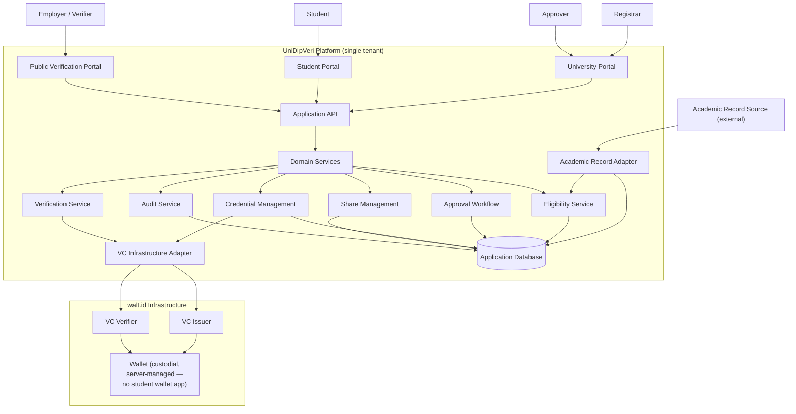

# Architecture & Design

**Version:** 2.0

This document contains architectural and design decisions that support the requirements in `docs/01-requirements/SRS.md` (v2.0). It is not part of the SRS: it describes _how_ the system is built, not _what_ it must do.

**Updated for v2.0:** the SRS now models academic records as arriving from an external, trusted Academic Record Source, and inserts a graduation-eligibility evaluation step before a credential can be requested. This document adds the components that implement that.

---

## 1. Layered Architecture

```
Academic Record Source (external)
        │
        ▼
Academic Record Adapter ──▶ Eligibility Service
                                     │
                                     ▼
Frontend (3 portals)          Application REST API
   │                                │
   ▼                                ▼
Application REST API ──▶ Domain services (Eligibility, Approval, Credential, Share, Verify, Audit)
                                     │
                                     └── VC Infrastructure Adapter
                                                  │
                                                  ▼
                                               walt.id (Issuer + Verifier)
```

The frontend never calls walt.id, or the Academic Record Source, directly. Two adapters bound the system: the **Academic Record Adapter** (inbound, trusted external data) and the **VC Infrastructure Adapter** (outbound, cryptographic operations). Everything between them is domain logic the thesis owns.

## 2. Academic Record Adapter & Eligibility Service (new)

```
AcademicRecordAdapter
├── importRecord(sourcePayload)     // normalizes source data into STUDENT / ACADEMIC_RECORD
└── getRecord(studentId)

EligibilityService
├── evaluate(studentId, programId)  // applies ELIGIBILITY_RULE set to ACADEMIC_RECORD
└── getLatestEvaluation(studentId, programId)
```

Design intent:

- **`AcademicRecordAdapter` is the only component allowed to write `STUDENT`/`ACADEMIC_RECORD` data.** The Registrar portal is read-only over imported records (it can view them and trigger re-import/re-evaluation, but does not hand-author grades or credits) — this is what makes AS-01 ("source records are trusted as correct on import") an enforceable boundary rather than just a policy statement.
- **`EligibilityService` never touches walt.id.** It only reasons over `ACADEMIC_RECORD` + `ELIGIBILITY_RULE` and produces an `ELIGIBILITY_EVALUATION`. This keeps "is this student eligible" and "is this credential cryptographically valid" as two separably-testable concerns, matching SRS NFR-07's three-tier trust distinction.
- **Eligibility is evaluated, not imported.** The source system supplies raw records (grades, credits, courses); UniDipVeri computes `ELIGIBLE`/`NOT_ELIGIBLE` itself against configured rules (FR-ELIG-03–06), so the eligibility _decision_ is this system's own output and is auditable, even though the underlying _facts_ are trusted input.

## 3. VC Adapter (unchanged from v1)

```
Your application
       │
       ▼
VCService (interface)
       │
       ▼
WaltIdVCService (implementation)
       │
       ▼
walt.id REST API
```

```
VCService
├── issueCredential()
├── verifyCredential()
├── revokeCredential()
└── getCredentialStatus()
```

Not exposed as a public API endpoint. This is the seam where a different VC provider could be substituted.

## 3a. walt.id Integration Model (custody & protocol choice)

UniDipVeri uses three walt.id Community Stack capabilities, all reached exclusively through `WaltIdVCService` — never called by any frontend, and never called directly by the student or verifier:

- **Issuer API** — signs and issues the VC when `Domain services → Credential Management` completes an approved request.
- **Wallet API (custodial, server-managed)** — holds the issued VC on the university's behalf. There is no student-controlled wallet identity, no wallet app, and no student action required to "receive" a credential: on successful issuance, the VC is placed directly into a server-managed wallet entry associated with the student, and `Credential.vc_reference` (Data_Model.md) stores that entry's identifier — not the raw VC document. This is what makes SRS §2.6's "no custom wallet" constraint concrete: UniDipVeri builds no wallet UX because the student is never expected to hold or operate a wallet at all.
- **Verifier API** — called server-to-server by the Verification Service using the stored `vc_reference`, not by presenting a credential from an external, student-held wallet.

**Why not OID4VP.** OID4VP is a holder-initiated presentation protocol: it assumes a verifier requests a credential and a student's wallet is online to respond at that moment. UniDipVeri's sharing model (UC-12/UC-14) is the opposite — the student pre-authorizes one credential via a share link, and any verifier who later opens that link gets a result with no student interaction at verification time. Wrapping this in OID4VP would require the student's wallet to be reachable whenever a verifier checks the link, which conflicts with the "issue-once, verify-anytime" model (SRS §1.2). UniDipVeri's share token is therefore its own application-level artifact (`SHARE.token_hash`), and verification is a direct `WaltIdVCService.verifyCredential(vc_reference)` call. Any OID4VP capability the Community Stack exposes is not used by this system — consistent with SRS §3.2, which lists OID4VP as future work, not a chosen mechanism.

## 4. API-to-Infrastructure Mapping

| Application API                                                              | Infrastructure                                  |
| ---------------------------------------------------------------------------- | ----------------------------------------------- |
| `POST /api/academic-records/import`                                          | Academic Record Source (inbound)                |
| `POST /api/students/{id}/eligibility/evaluate`                               | EligibilityService (internal, no external call) |
| `POST /api/credential-requests/{id}/issue` (internal, triggered on approval) | walt.id issuer                                  |
| `POST /api/credentials/{id}/revoke`                                          | walt.id status mechanism                        |
| `POST /api/public/shares/{token}/verify`                                     | walt.id verifier                                |
| `Credential.vc_reference`                                                    | walt.id credential reference                    |
| `CredentialSchema`                                                           | walt.id schema/configuration                    |

## 5. End-to-End Workflow (Design)

```
Academic Record Source → import → STUDENT / ACADEMIC_RECORD (trusted as correct)
        │
        ▼
EligibilityService.evaluate() → ELIGIBILITY_EVALUATION: ELIGIBLE | NOT_ELIGIBLE
        │
   ┌────┴─────────────┐
   ▼                   ▼
NOT_ELIGIBLE       ELIGIBLE
   │                   │
No request         Registrar may create
possible            CREDENTIAL_ISSUANCE_REQUEST → PENDING_APPROVAL
                        │
                        ▼
                 Approver(s) decide, per ApprovalPolicy.requiredApprovals (MVP = 1)
                        │
                   ┌────┴────┐
                   ▼         ▼
               APPROVED   REJECTED
                   │
                   ▼
           VCService.issueCredential()
                   │
                   ▼
           Credential.status = VALID
```

This is the traceability chain required by SRS NFR-06: _Academic Record Imported → Eligibility Evaluated → (Eligible → Issuance Requested → Approved → Issued) or (Not Eligible → No Issuance)_. Each arrow corresponds to a persisted, timestamped record (`ACADEMIC_RECORD`, `ELIGIBILITY_EVALUATION`, `CREDENTIAL_ISSUANCE_REQUEST`, `CREDENTIAL_APPROVAL`, `CREDENTIAL`), so the whole chain is reconstructable from the database without relying on a separate audit log being kept in sync.

The reissuance workflow after a revocation reuses this same chain — a reissuance request still requires a current `ELIGIBLE` evaluation, not just the historical fact that the student was once eligible (FR-ELIG-10: rule changes don't retroactively affect _already-issued_ credentials, but a reissuance is a new issuance and is re-evaluated).

## 6. System Boundary



## 7. Design Notes

- **Single tenant by design, not just by data.** `university_id` is not treated as a future multi-tenancy seam. If multi-tenancy is ever needed, it's a separate future project.
- **Three-tier trust boundary (updated).** The system now distinguishes three layers, matching NFR-07:
    1. _Source academic records_ — trusted as correct on import (AS-01); UniDipVeri does not re-authenticate them.
    2. _Eligibility determination_ — computed by UniDipVeri itself from those records against configured rules; this is a claim the system does make and is responsible for getting right.
    3. _Credential cryptographic status_ — issuer authenticity, integrity, and revocation status, delegated to and guaranteed by walt.id.
       A verifier's `VERIFIED` result only ever speaks to layer 3. It is not a re-statement of layer 1's or layer 2's truth, which is why FR-VER-08 keeps the raw VC out of the default UI and instead shows the plain-language, pre-scoped summary.
- **Eligibility as a first-class, versioned decision.** Because `ELIGIBLITY_RULE` sets can change over time, each `ELIGIBILITY_EVALUATION` stores which rule version it ran against, so past decisions remain explainable even after rules are edited (FR-ELIG-10).
- **Approval policy as data.** Unchanged from v1: `ApprovalPolicy.requiredApprovals` defaults to 1 but is configuration, not a constant.
- **Custody model.** Issued VCs are held in walt.id's server-side Wallet API on the university's behalf (see §3a), not in a student-controlled wallet. This is a deliberate simplification, not an oversight: it keeps "receiving" a credential a zero-interaction event for the student and keeps sharing/verification a server-mediated flow rather than a wallet-presentation protocol.
- **Import mechanism is intentionally unspecified beyond an adapter boundary.** The SRS does not mandate _how_ the Academic Record Source delivers data (batch file, webhook, pull API) — only that UniDipVeri treats whatever arrives through `AcademicRecordAdapter` as trusted input. `API_Specification.md` picks one concrete shape (a POST import endpoint) for the prototype; swapping it later shouldn't touch `EligibilityService` or anything downstream.

## 8. Thesis Contribution Boundary

**My contribution:** academic-record-to-eligibility pipeline, eligibility rule evaluation, issuance-with-approval workflow, credential lifecycle (issue/revoke/reissue), short-lived sharing, public verification UX, audit trail, evaluation.

**External Academic Record Source's contribution:** authoritative academic data (out of this project's build scope; assumed to exist and be correct).

**walt.id's contribution:** VC infrastructure, cryptographic issuance and verification mechanisms.

Freeze this scope. Do not add multi-university support, OID4VP, multi-step approval chains, or a real integration with a specific SIS during the MVP — put them under Future Work. The research question stays clean: _can a VC-based, eligibility-gated, approval-gated, short-lived self-service verification workflow make academic credential verification more convenient than the traditional manual process?_

## 9. Future Work

- **Batch academic record import.** For large graduating cohorts, the Academic Record Adapter could accept a file or array payload and process records in a loop, reusing the same per-record validation and eligibility-trigger logic (§2) — no change to EligibilityService or downstream layers.
- **Batch eligibility evaluation.** A cohort-wide "evaluate all students in program X" operation, implemented as a loop over the existing evaluate() call.
- **Batch approval.** A UI convenience for an Approver to approve multiple pending requests in one action. If built, each approval must still be recorded as a distinct, individually timestamped CREDENTIAL_APPROVAL row (FR-APPR-08, NFR-06) — batching the UI action must not batch the audit semantics.
