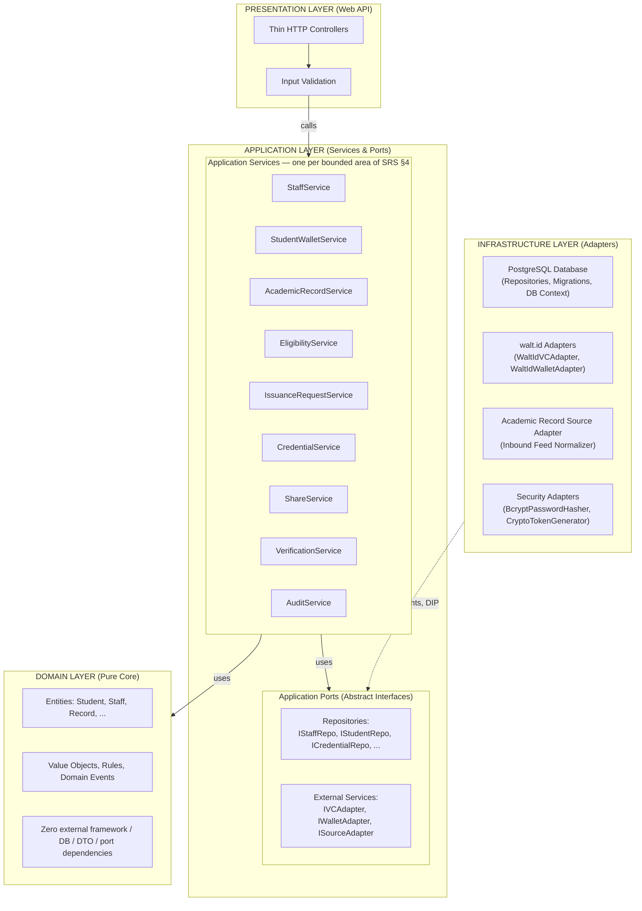
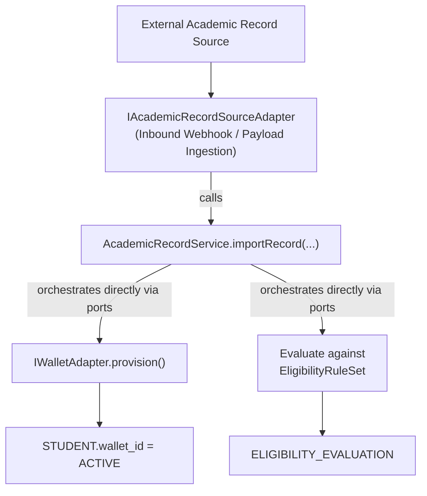
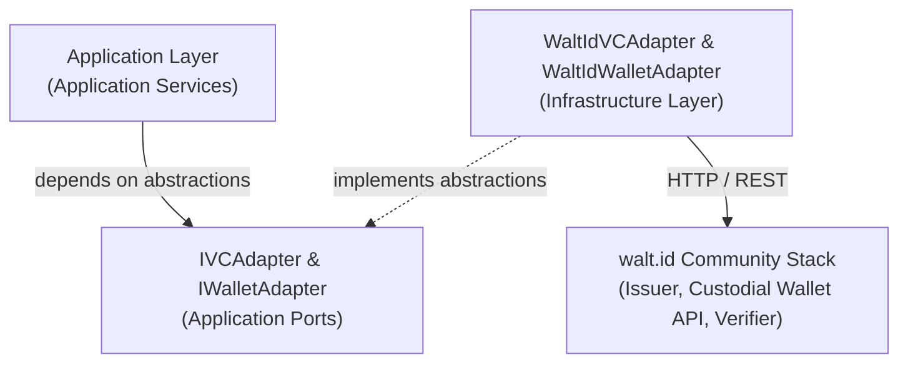
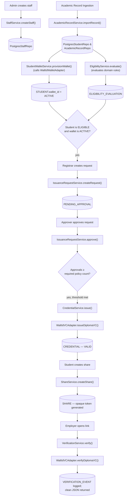

# Architecture & Design

**Version:** 3.0

This document contains architectural and design decisions supporting `docs/01-requirements/SRS.md` (v2.2). It specifies the technical organization of UniDipVeri using **Clean Architecture**: a small set of layers with dependencies pointing strictly inward, keeping the domain core free of framework, database, and external-API concerns.

> **Change from v2.1:** The previous design layered a CQRS Command/Query split and per-feature Vertical Slices on top of Clean Architecture, dispatched through an in-memory Mediator. That structure has been removed. UniDipVeri now uses the minimum architecture that satisfies Clean Architecture's actual requirements — inward dependencies and a pure domain core — via a small set of **Application Services**, one per bounded area of the system. See §1.2 for the rationale.

---

## 1. Architectural Strategy: Clean Architecture



### 1.1 The Dependency Inversion Principle (DIP) & Domain Purity

- All source code dependencies point **inward** toward the Domain Layer.
- The **Domain Layer** is a pure enterprise core. It contains entities, value objects, business rules, and domain events. It has **zero dependencies** on application services, DTOs, databases, ORMs, or external APIs.
- The **Application Layer** defines abstract repository ports and external service ports, and implements one **Application Service** per bounded area of the system (Staff, Student & Wallet, Academic Records, Eligibility, Issuance Requests, Credentials, Sharing, Verification, Audit). Each service exposes plain methods (e.g. `IssuanceRequestService.createRequest(...)`, `.approve(...)`, `.reject(...)`) and coordinates domain entities by calling its own injected ports directly.
- The **Infrastructure Layer** (PostgreSQL, `walt.id`, external source connectors) lives on the outside and implements the application ports.
- The **Presentation Layer** contains thin controllers whose sole responsibility is mapping HTTP payloads to a method call on the relevant Application Service, and mapping the result back to an HTTP response.

### 1.2 Why not CQRS / Vertical Slices / a Mediator?

For a single-tenant prototype of this size, a full CQRS split (one Command/Query class plus one Handler class per operation, dispatched through an in-memory Mediator) and per-feature vertical-slice folders add indirection without a matching benefit: there is no separate read model, no event sourcing, and no need to scale reads and writes independently. UniDipVeri instead uses the **minimum viable form of Clean Architecture**:

- **One Application Service class per bounded area**, grouping its related operations as plain methods, instead of one Command/Query class and one Handler class per operation.
- **Controllers call Application Services directly** via constructor/DI injection, instead of routing through an `IMediator`.
- Read-only operations (e.g. `listStudents`, `getEligibilityResult`) and state-changing operations (e.g. `approve`, `issue`) live on the same service, since they share the same repository ports and domain rules. The read/write distinction is documented per method (see §4) rather than enforced through parallel class hierarchies.

This preserves the property that actually matters — **domain purity and dependency inversion** — while removing structure that wasn't earning its cost at this scale. Nothing about the domain model, ports, data model, or external endpoints changes as a result of this simplification; only the internal shape of the Application Layer does.

---

## 2. Inbound Data Ingestion & Eligibility Pipeline



Design intent:

- **Strict Ingestion Boundary:** `IAcademicRecordSourceAdapter` is the only write path for `STUDENT` and `ACADEMIC_RECORD` entities. The Registrar UI is strictly read-only for academic achievement data, enforcing assumption `AS-01` ("source records are trusted as correct on import").
- **Custodial Wallet Provisioning:** `StudentWalletService.provisionWallet(...)` invokes `IWalletAdapter.provisionCustodialWallet()` to create a server-managed custodial wallet on `walt.id`, storing `wallet_id` and setting `wallet_status = ACTIVE`. If `walt.id` is unreachable, `wallet_status` is set to `FAILED`, enabling manual retry via `POST /api/students/{id}/wallet/provision`.
- **Decoupled Eligibility Calculation:** `EligibilityService.evaluate(...)` evaluates student records against `EligibilityRuleSet` entities purely in memory/domain logic, producing an `EligibilityEvaluation` (`ELIGIBLE` or `NOT_ELIGIBLE`). It never interacts with `walt.id`.

---

## 3. VC & Wallet Ports and Adapters



### Application Port Definitions

```csharp
public interface IVCAdapter {
    Task<VCReferenceResult> IssueDiplomaVCAsync(string walletId, CredentialSubject subject);
    Task<VerificationOutcome> VerifyDiplomaVCAsync(string vcReference);
    Task<bool> RevokeDiplomaVCAsync(string vcReference, string reason);
}

public interface IWalletAdapter {
    Task<WalletProvisionResult> ProvisionCustodialWalletAsync(string studentIdentifier);
    Task<WalletDetails> GetWalletDetailsAsync(string walletId);
}

public interface IAcademicRecordSourceAdapter {
    Task<AcademicRecordImportDTO> NormalizePayloadAsync(object rawSourcePayload);
}
```

### 3a. walt.id Protocol Integration, Custody Model & Profile Configuration

`walt.id` provides issuance and verification via OID4VCI and OID4VP. In UniDipVeri, these protocols run **entirely server-side** without interactive holder prompts:

- **Deployment-Time Profile Preconfiguration (AS-03):** walt.id requires issuer profiles to be statically defined in `issuer2-profiles.conf` (e.g. `miuAcademicDiploma` declaring `credentialConfigurationId = "AcademicDiploma_jwt_vc_json"` and referencing MIU's issuer signing key / DID). These profiles act as issuance templates and are loaded when the walt.id service boots. UniDipVeri stores this identifier in `CREDENTIAL_SCHEMA.schema_uri` and passes it during issuance, eliminating any need for dynamic, runtime admin schema creation in walt.id.
- **Custodial Server-Managed Wallets:** Students do not install wallet apps. The backend creates server-managed wallet identities via `IWalletAdapter` upon student ingestion.
- **Server-Driven OID4VCI (Issuance):** In `CredentialService.issue(...)`, `WaltIdVCAdapter` calls walt.id's issuance endpoint with the preconfigured `credentialConfigurationId` and dynamic subject claims, acting as the holder side of the OID4VCI exchange using the student's `wallet_id` to accept the credential automatically. The resulting wallet identifier is stored as `Credential.vc_reference`.
- **Server-Driven OID4VP (Verification):** In `VerificationService.verify(...)`, `WaltIdVCAdapter` triggers and completes the OID4VP presentation exchange internally against the server-managed wallet. Verifiers communicate strictly with UniDipVeri's `/api/public/shares/{token}/verify` endpoint, receiving clean JSON verification summaries.

---

## 4. Application Services & Infrastructure Mapping

| HTTP Endpoint                                                           | Application Service      | Method                            | Infrastructure Adapter                                                             |
| :---------------------------------------------------------------------- | :----------------------- | :-------------------------------- | :--------------------------------------------------------------------------------- |
| `POST /api/staff`                                                       | `StaffService`           | `createStaff`                     | `PostgresStaffRepository`, `BcryptPasswordHasher`                                  |
| `PATCH /api/staff/{id}`                                                 | `StaffService`           | `updateStaff` / `deactivateStaff` | `PostgresStaffRepository`                                                          |
| `GET /api/staff`                                                        | `StaffService`           | `listStaff`                       | `PostgresStaffRepository`                                                          |
| `POST /api/academic-records/import`                                     | `AcademicRecordService`  | `importRecord`                    | `PostgresStudentRepository`, `PostgresAcademicRecordRepository`                    |
| `GET /api/students`, `GET /api/students/{id}`                           | `StudentWalletService`   | `listStudents` / `getStudent`     | `PostgresStudentRepository`                                                        |
| `POST /api/students/{id}/wallet/provision`                              | `StudentWalletService`   | `provisionWallet`                 | `WaltIdWalletAdapter`, `PostgresStudentRepository`                                 |
| `POST /api/students/{id}/eligibility/evaluate`                          | `EligibilityService`     | `evaluate`                        | `PostgresEligibilityRepository`                                                    |
| `POST /api/credential-requests`                                         | `IssuanceRequestService` | `createRequest`                   | `PostgresCredentialRequestRepository`                                              |
| `GET /api/credential-requests/pending`                                  | `IssuanceRequestService` | `listPending`                     | `PostgresCredentialRequestRepository`                                              |
| `POST /api/credential-requests/{id}/approve`                            | `IssuanceRequestService` | `approve`                         | `PostgresCredentialRequestRepository`, `PostgresApprovalPolicyRepository`          |
| `POST /api/credential-requests/{id}/reject`                             | `IssuanceRequestService` | `reject`                          | `PostgresCredentialRequestRepository`                                              |
| `Internal Issuance Trigger` (called by `approve` once threshold is met) | `CredentialService`      | `issue`                           | `WaltIdVCAdapter`, `PostgresCredentialRepository`                                  |
| `POST /api/credentials/{id}/revoke`                                     | `CredentialService`      | `revoke`                          | `WaltIdVCAdapter`, `PostgresCredentialRepository`                                  |
| `POST /api/credentials/{id}/reissue`                                    | `CredentialService`      | `reissue`                         | `PostgresCredentialRepository` (delegates re-approval to `IssuanceRequestService`) |
| `POST /api/credentials/{id}/shares`                                     | `ShareService`           | `createShare`                     | `PostgresShareRepository`, `CryptoTokenGenerator`                                  |
| `POST /api/shares/{id}/revoke`                                          | `ShareService`           | `revokeShare`                     | `PostgresShareRepository`                                                          |
| `POST /api/public/shares/{token}/verify`                                | `VerificationService`    | `verify`                          | `WaltIdVCAdapter`, `PostgresVerificationEventRepository`                           |
| `GET /api/audit`                                                        | `AuditService`           | `getAuditHistory`                 | `PostgresAuditRepository`                                                          |

`IssuanceRequestService.approve(...)` calls `CredentialService.issue(...)` directly once the approval threshold is met — a plain method call across two Application Services, not an event or a mediator dispatch.

---

## 5. End-to-End Traceability Workflow



This workflow guarantees the complete traceability chain mandated by SRS `NFR-06` and `AC-14`/`AC-15`:
_Staff Configured → Academic Record Ingested → Student Wallet Provisioned → Eligibility Evaluated → Issuance Requested → Approved → Issued to Wallet → Shared → Verified._

---

## 6. System Boundary

```mermaid
flowchart TB

    Source["Academic Record Source (external)"]
    Admin["Platform Administrator"]
    Registrar["Registrar"]
    Approver["Approver"]
    Student["Student"]
    Verifier["Employer / Verifier"]

    subgraph UDV["UniDipVeri Platform (Clean Architecture)"]
        InboundAdapter["Inbound Academic Record Adapter"]

        subgraph Pres["Presentation Layer (Web API)"]
            Controllers["HTTP REST Controllers"]
        end

        subgraph App["Application Layer (Application Services)"]
            StaffSvc["StaffService"]
            WalletSvc["StudentWalletService"]
            RecordSvc["AcademicRecordService"]
            EligSvc["EligibilityService"]
            ReqSvc["IssuanceRequestService"]
            CredSvc["CredentialService"]
            ShareSvc["ShareService"]
            VerifySvc["VerificationService"]
            AuditSvc["AuditService"]
        end

        subgraph Ports["Application Port Interfaces"]
            RepoPorts["Repository Ports\n(IStaffRepo, IStudentRepo, ICredentialRepo, ...)"]
            ExtPorts["External Service Ports\n(IVCAdapter, IWalletAdapter, ISourceAdapter)"]
        end

        subgraph Domain["Domain Layer (Pure Core Entities & Rules)"]
            Entities["Entities: UniversityStaff, Student, AcademicRecord, Credential, ..."]
            Rules["Rules Engine & Aggregates"]
        end

        subgraph Infra["Infrastructure Layer (Adapters)"]
            Postgres["PostgreSQL Database Repositories\n(EF Core / Prisma / Dapper)"]
            WaltVC["WaltIdVCAdapter (OID4VCI / OID4VP)"]
            WaltWallet["WaltIdWalletAdapter (Custodial Wallet API)"]
            Security["Security & Crypto Utilities"]
        end

        DB[("PostgreSQL Database")]
    end

    subgraph Walt["walt.id Infrastructure"]
        Issuer["VC Issuer"]
        Wallet["Wallet API (Custodial)"]
        WaltVerifier["VC Verifier"]
    end

    Source --> InboundAdapter
    InboundAdapter --> RecordSvc

    Admin --> Controllers
    Registrar --> Controllers
    Approver --> Controllers
    Student --> Controllers
    Verifier --> Controllers

    Controllers --> App

    App --> Domain
    App --> Ports
    Infra -.implements.-> Ports

    Postgres --> DB
    WaltVC --> Issuer
    WaltVC --> WaltVerifier
    WaltWallet --> Wallet
    WaltVC --> Wallet
```



---

## 7. Key Design Principles & Architectural Benefits

1. **Pure Domain Core:** The Domain Core contains entities, value objects, business rules, and domain events with zero dependencies on application services, DTOs, databases, ORMs, or external APIs.
2. **Dependency Inversion:** Application Services depend only on Application Port interfaces; the Infrastructure Layer implements those ports and is swappable (e.g. a different VC provider than walt.id) without touching Application or Domain code.
3. **Cohesion by Bounded Area:** Grouping operations into one Application Service per bounded area (Staff, Wallet, Records, Eligibility, Issuance, Credentials, Sharing, Verification, Audit) keeps related logic together. A change to share expiration only touches `ShareService` and cannot inadvertently break credential issuance or staff login.
4. **Explicit, Direct Orchestration:** Application Services call other Application Services or ports directly by method call — no mediator, no hidden dispatch table. `IssuanceRequestService.approve()` calling `CredentialService.issue()` is visible in the code, not inferred from a routing configuration.
5. **Minimum Viable Structure:** No Command/Query class pairs, no per-operation Handler classes, no in-memory Mediator, no per-feature slice directories — one service class and a handful of methods per bounded area. A single PostgreSQL database instance is used without distributed read databases or event sourcing.
6. **Three-Tier Trust Isolation:**
    - _Tier 1 (Source Facts):_ Ingested via `IAcademicRecordSourceAdapter` and trusted as input.
    - _Tier 2 (Eligibility Claims):_ Computed strictly by `EligibilityService` against versioned domain rules.
    - _Tier 3 (Cryptographic Trust):_ Handled via `IVCAdapter` and backed by `walt.id`.
