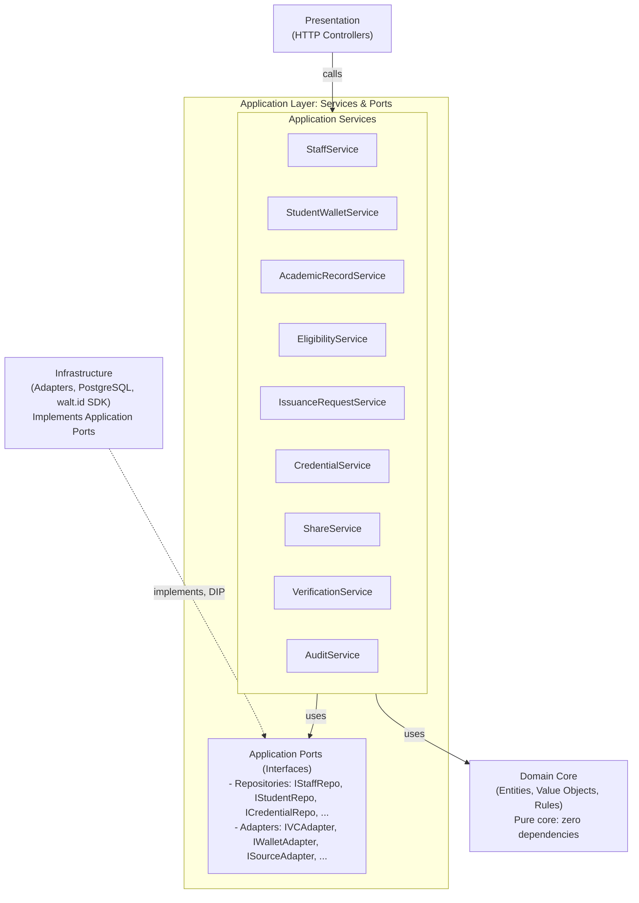
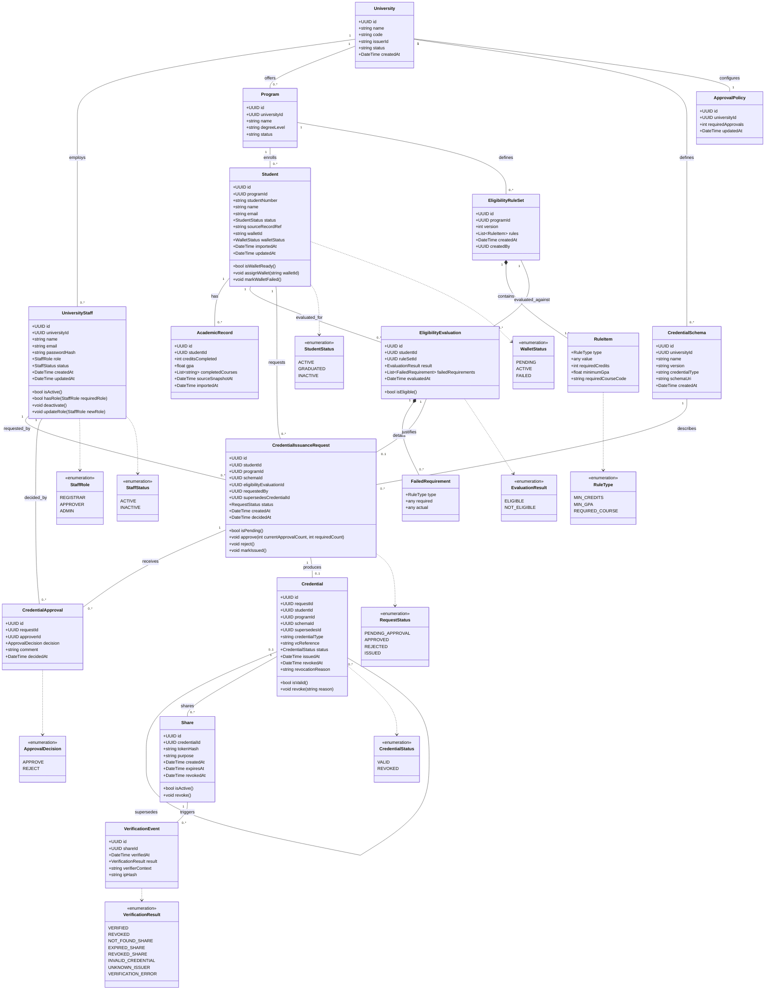

# Class Diagram

**Version:** 0.2.0

Companion to `docs/01-requirements/SRS.md`, `docs/03-design/Architecture_Design.md`, `docs/03-design/Data_Model.md`, and `docs/04-api/API_Specification.md`. This document presents the structural design of UniDipVeri using plain **Clean Architecture**.

---

## 1. Architectural Strategy: Clean Architecture

UniDipVeri structures its codebase into four layers with strict, inward-pointing dependencies and no unnecessary indirection:

1. **Domain Layer (Core):** Pure enterprise entities, value objects, business rules, domain exceptions, and domain events. Has **zero dependencies** on application services, DTOs, databases, ORMs, or external APIs.
2. **Application Layer (Services & Ports):** One **Application Service** per bounded area (Staff, Student & Wallet, Academic Records, Eligibility, Issuance Requests, Credentials, Sharing, Verification, Audit), each exposing the plain methods needed for that area's use cases, plus their DTOs. Application ports (repository interfaces and external-service interfaces) also reside here. Services orchestrate workflows by calling their own injected ports, or by calling another Application Service directly, with no intermediate dispatch mechanism.
3. **Infrastructure Layer (Adapters):** Implements Application-layer repository and external service ports using a single PostgreSQL database (`PostgresStaffRepository`, etc.), `walt.id` API adapters (`WaltIdVCAdapter`, `WaltIdWalletAdapter`), inbound record feed adapters (`HttpAcademicRecordSourceAdapter`), and security utilities.
4. **Presentation Layer (Web API):** Thin HTTP controllers that deserialize HTTP requests into method arguments, call the relevant Application Service directly, and map its return value to an HTTP response.

---

## 2. Domain Layer (Pure Enterprise Core)

The domain core holds enterprise entities, business rules, domain events, and enumerations. It contains no DTOs, no repository interfaces, and no external references.

---

## 3. Application Layer Ports (Abstract Interfaces)

The Application Layer defines abstract repository interfaces and external service ports. Application Services depend solely on these ports; the Infrastructure layer provides concrete implementations.

```mermaid
classDiagram
    direction TB

    class IStaffRepository {
        <<interface>>
        +findById(UUID id) UniversityStaff
        +findByEmail(string email) UniversityStaff
        +countActiveAdmins() int
        +listAll() List~UniversityStaff~
        +save(UniversityStaff staff) void
        +update(UniversityStaff staff) void
    }

    class IStudentRepository {
        <<interface>>
        +findById(UUID id) Student
        +findByStudentNumber(string number) Student
        +listPaged(StudentFilter filter) PagedList~Student~
        +save(Student student) void
        +update(Student student) void
    }

    class IAcademicRecordRepository {
        <<interface>>
        +findByStudentId(UUID studentId) AcademicRecord
        +save(AcademicRecord record) void
        +update(AcademicRecord record) void
    }

    class IEligibilityRepository {
        <<interface>>
        +findLatestByStudent(UUID studentId, UUID programId) EligibilityEvaluation
        +findRuleSetByProgram(UUID programId) EligibilityRuleSet
        +saveEvaluation(EligibilityEvaluation evaluation) void
        +saveRuleSet(EligibilityRuleSet ruleSet) void
    }

    class ICredentialRequestRepository {
        <<interface>>
        +findById(UUID id) CredentialIssuanceRequest
        +findActiveByStudentAndType(UUID studentId, string type) CredentialIssuanceRequest
        +listPending() List~CredentialIssuanceRequest~
        +saveRequest(CredentialIssuanceRequest request) void
        +saveApproval(CredentialApproval approval) void
        +countApprovals(UUID requestId) int
        +hasApproverVoted(UUID requestId, UUID approverId) bool
    }

    class ICredentialRepository {
        <<interface>>
        +findById(UUID id) Credential
        +findByStudentId(UUID studentId) List~Credential~
        +save(Credential credential) void
        +update(Credential credential) void
    }

    class IShareRepository {
        <<interface>>
        +findById(UUID id) Share
        +findByTokenHash(string tokenHash) Share
        +listByCredentialId(UUID credentialId) List~Share~
        +listByStudentId(UUID studentId) List~Share~
        +save(Share share) void
        +update(Share share) void
    }

    class IVerificationEventRepository {
        <<interface>>
        +save(VerificationEvent event) void
        +listByShareId(UUID shareId) List~VerificationEvent~
        +listByStudentId(UUID studentId) List~VerificationEvent~
    }

    class IApprovalPolicyRepository {
        <<interface>>
        +getPolicy() ApprovalPolicy
        +updatePolicy(int requiredApprovals) void
    }

    class IVCAdapter {
        <<interface>>
        +issueDiplomaVC(string walletId, CredentialSubject subject) VCReferenceResult
        +verifyDiplomaVC(string vcReference) VerificationOutcome
        +revokeDiplomaVC(string vcReference, string reason) bool
    }

    class IWalletAdapter {
        <<interface>>
        +provisionCustodialWallet(string studentIdentifier) WalletProvisionResult
        +getWalletDetails(string walletId) WalletDetails
    }

    class IAcademicRecordSourceAdapter {
        <<interface>>
        +normalizePayload(rawSourcePayload) AcademicRecordImportDTO
    }

    class IPasswordHasher {
        <<interface>>
        +hash(string password) string
        +verify(string password, string hash) bool
    }

    class ITokenGenerator {
        <<interface>>
        +generateOpaqueToken() string
        +hashToken(string token) string
    }
```

---

## 4. Application Layer: Services

Each Application Service owns one bounded area of the system (matching SRS §4) and exposes the plain methods needed for its use cases, together with its DTOs. Services orchestrate workflows by calling their injected ports, or by calling another Application Service directly — no Command/Query wrapper classes, no per-operation Handler classes, no Mediator.

```mermaid
classDiagram
    direction TB

    class StaffService {
        -IStaffRepository staffRepo
        -IPasswordHasher passwordHasher
        +createStaff(string name, string email, string password, StaffRole role) StaffDTO
        +updateStaff(UUID staffId, ProfileUpdateDTO profile, List~StaffRole~ roles) StaffDTO
        +deactivateStaff(UUID staffId) StaffDTO
        +listStaff() List~StaffDTO~
    }

    class StudentWalletService {
        -IStudentRepository studentRepo
        -IWalletAdapter walletAdapter
        +provisionWallet(UUID studentId) WalletStatusDTO
        +listStudents(StudentFilter filter) PagedResult~StudentDTO~
        +getStudent(UUID studentId) StudentDTO
    }

    class AcademicRecordService {
        -IStudentRepository studentRepo
        -IAcademicRecordRepository recordRepo
        -StudentWalletService walletService
        -EligibilityService eligibilityService
        +importRecord(ImportAcademicRecordDTO payload) ImportResultDTO
        +getRecord(UUID studentId) AcademicRecordDTO
    }

    class EligibilityService {
        -IAcademicRecordRepository recordRepo
        -IEligibilityRepository eligibilityRepo
        +evaluate(UUID studentId, UUID programId) EvaluationResultDTO
        +getLatestResult(UUID studentId) EvaluationResultDTO
    }

    class IssuanceRequestService {
        -IEligibilityRepository eligibilityRepo
        -IStudentRepository studentRepo
        -ICredentialRequestRepository requestRepo
        -IApprovalPolicyRepository policyRepo
        -CredentialService credentialService
        +createRequest(UUID studentId, UUID programId, string credentialType, UUID requestedByStaffId) RequestDTO
        +listPending() List~RequestDTO~
        +approve(UUID requestId, UUID approverStaffId, string comment) RequestDTO
        +reject(UUID requestId, UUID approverStaffId, string reason) RequestDTO
    }

    class CredentialService {
        -ICredentialRequestRepository requestRepo
        -IStudentRepository studentRepo
        -ICredentialRepository credentialRepo
        -IVCAdapter vcAdapter
        +issue(UUID requestId) CredentialDTO
        +revoke(UUID credentialId, string reason, UUID actorStaffId) CredentialDTO
        +reissue(UUID credentialId, UUID requestedByStaffId) RequestDTO
        +getDetails(UUID credentialId) CredentialDTO
    }

    class ShareService {
        -ICredentialRepository credentialRepo
        -IShareRepository shareRepo
        -ITokenGenerator tokenGen
        +createShare(UUID credentialId, UUID studentId, DateTime expiresAt, string purpose) ShareResultDTO
        +revokeShare(UUID shareId, UUID studentId) ShareResultDTO
        +listShares(UUID studentId) List~ShareDTO~
        +resolveShare(string token) ShareStatusDTO
        listVerificationSummary(UUID studentId) List~ShareVerificationSummaryDTO~
    }

    class VerificationService {
        -IShareRepository shareRepo
        -ICredentialRepository credentialRepo
        -IVCAdapter vcAdapter
        -IVerificationEventRepository eventRepo
        +verify(string shareToken, string ipAddress, string userAgent) VerificationResponseDTO
    }

    class AuditService {
        -IStaffRepository staffRepo
        -IStudentRepository studentRepo
        -IAcademicRecordRepository recordRepo
        -IEligibilityRepository eligibilityRepo
        -ICredentialRequestRepository requestRepo
        -ICredentialRepository credentialRepo
        -IShareRepository shareRepo
        -IVerificationEventRepository verificationEventRepo
        +getAuditHistory(AuditScopeDTO scope) List~AuditEventDTO~
    }

    %% Cross-service orchestration (direct calls, no mediator)
    AcademicRecordService ..> StudentWalletService : triggers provisionWallet()
    AcademicRecordService ..> EligibilityService : triggers evaluate()
    IssuanceRequestService ..> EligibilityService : reads latest evaluation
    IssuanceRequestService ..> CredentialService : issue() once threshold met
    CredentialService ..> IssuanceRequestService : reissue() creates new request
```

Note on read vs. write: methods that only read state (`listStaff`, `getStudent`, `getLatestResult`, `listPending`, `getDetails`, `listShares`, `resolveShare`, `getAuditHistory`) never mutate a repository or call an external adapter that changes state; methods that do mutate state are documented as such above. This is enforced by code review and unit tests rather than by a separate Query class hierarchy.

Note on share: `listVerificationSummary` reads via `IVerificationEventRepository` (injected alongside AuditService's copy — both services depend on the same port; no duplication of the store itself) and groups results by `share_id` within a configurable time window before returning, per **NFR-08**. It never mutates state.

Note: `ShareVerificationSummaryDTO = {shareId, credentialId, credentialType, latestResult, attemptCount, lastVerifiedAt}`, sourced by `IVerificationEventRepository.listByShareId` grouped/aggregated per share the student owns (via `IShareRepository`). Still read-only, no state mutation.

---

## 5. Infrastructure Layer (PostgreSQL & External Adapters)

The infrastructure layer resides outside the core and implements all application repository and adapter ports. A single PostgreSQL database is used for persistence.

```mermaid
classDiagram
    direction TB

    class PostgresStaffRepository {
        -NpgsqlConnection dbConnection
        +findById(UUID id) UniversityStaff
        +findByEmail(string email) UniversityStaff
        +countActiveAdmins() int
        +listAll() List~UniversityStaff~
        +save(UniversityStaff staff) void
        +update(UniversityStaff staff) void
    }

    class PostgresStudentRepository {
        -NpgsqlConnection dbConnection
        +findById(UUID id) Student
        +findByStudentNumber(string number) Student
        +listPaged(StudentFilter filter) PagedList~Student~
        +save(Student student) void
        +update(Student student) void
    }

    class PostgresAcademicRecordRepository {
        -NpgsqlConnection dbConnection
        +findByStudentId(UUID studentId) AcademicRecord
        +save(AcademicRecord record) void
        +update(AcademicRecord record) void
    }

    class PostgresEligibilityRepository {
        -NpgsqlConnection dbConnection
        +findLatestByStudent(UUID studentId, UUID programId) EligibilityEvaluation
        +findRuleSetByProgram(UUID programId) EligibilityRuleSet
        +saveEvaluation(EligibilityEvaluation evaluation) void
        +saveRuleSet(EligibilityRuleSet ruleSet) void
    }

    class PostgresCredentialRequestRepository {
        -NpgsqlConnection dbConnection
        +findById(UUID id) CredentialIssuanceRequest
        +findActiveByStudentAndType(UUID studentId, string type) CredentialIssuanceRequest
        +listPending() List~CredentialIssuanceRequest~
        +saveRequest(CredentialIssuanceRequest request) void
        +saveApproval(CredentialApproval approval) void
        +countApprovals(UUID requestId) int
        +hasApproverVoted(UUID requestId, UUID approverId) bool
    }

    class PostgresCredentialRepository {
        -NpgsqlConnection dbConnection
        +findById(UUID id) Credential
        +findByStudentId(UUID studentId) List~Credential~
        +save(Credential credential) void
        +update(Credential credential) void
    }

    class PostgresShareRepository {
        -NpgsqlConnection dbConnection
        +findById(UUID id) Share
        +findByTokenHash(string tokenHash) Share
        +listByCredentialId(UUID credentialId) List~Share~
        +listByStudentId(UUID studentId) List~Share~
        +save(Share share) void
        +update(Share share) void
    }

    class PostgresVerificationEventRepository {
        -NpgsqlConnection dbConnection
        +save(VerificationEvent event) void
        +listByShareId(UUID shareId) List~VerificationEvent~
        +listByStudentId(UUID studentId) List~VerificationEvent~
    }

    class PostgresApprovalPolicyRepository {
        -NpgsqlConnection dbConnection
        +getPolicy() ApprovalPolicy
        +updatePolicy(int requiredApprovals) void
    }

    class WaltIdWalletAdapter {
        -HttpClient httpClient
        -string waltIdWalletBaseUrl
        +provisionCustodialWallet(string studentIdentifier) WalletProvisionResult
        +getWalletDetails(string walletId) WalletDetails
    }

    class WaltIdVCAdapter {
        -HttpClient httpClient
        -string waltIdIssuerUrl
        -string waltIdVerifierUrl
        +issueDiplomaVC(string walletId, CredentialSubject subject) VCReferenceResult
        +verifyDiplomaVC(string vcReference) VerificationOutcome
        +revokeDiplomaVC(string vcReference, string reason) bool
        -executeOid4vci(string walletId, CredentialSubject subject) string
        -executeOid4vp(string vcReference) VerificationOutcome
    }

    class HttpAcademicRecordSourceAdapter {
        +normalizePayload(rawSourcePayload) AcademicRecordImportDTO
    }

    class BcryptPasswordHasher {
        +hash(string password) string
        +verify(string password, string hash) bool
    }

    class CryptoTokenGenerator {
        +generateOpaqueToken() string
        +hashToken(string token) string
    }

    %% Interface Realizations
    PostgresStaffRepository ..|> IStaffRepository
    PostgresStudentRepository ..|> IStudentRepository
    PostgresAcademicRecordRepository ..|> IAcademicRecordRepository
    PostgresEligibilityRepository ..|> IEligibilityRepository
    PostgresCredentialRequestRepository ..|> ICredentialRequestRepository
    PostgresCredentialRepository ..|> ICredentialRepository
    PostgresShareRepository ..|> IShareRepository
    PostgresVerificationEventRepository ..|> IVerificationEventRepository
    PostgresApprovalPolicyRepository ..|> IApprovalPolicyRepository

    WaltIdWalletAdapter ..|> IWalletAdapter
    WaltIdVCAdapter ..|> IVCAdapter
    HttpAcademicRecordSourceAdapter ..|> IAcademicRecordSourceAdapter
    BcryptPasswordHasher ..|> IPasswordHasher
    CryptoTokenGenerator ..|> ITokenGenerator
```

---

## 6. Presentation Layer (Controllers to Application Services)

Controllers are thin HTTP entry points that map web requests directly into calls on the relevant Application Service.

```mermaid
classDiagram
    direction TB

    class StaffController {
        -StaffService staffService
        +createStaff(StaffCreateDTO req) ActionResult
        +updateStaff(UUID staffId, StaffUpdateDTO req) ActionResult
        +deactivateStaff(UUID staffId) ActionResult
        +listStaff() ActionResult
    }

    class StudentController {
        -StudentWalletService studentWalletService
        +listStudents(int page, int limit) ActionResult
        +getStudent(UUID studentId) ActionResult
        +provisionWallet(UUID studentId) ActionResult
    }

    class AcademicRecordController {
        -AcademicRecordService academicRecordService
        +importRecord(AcademicRecordImportDTO payload) ActionResult
        +getRecord(UUID studentId) ActionResult
    }

    class EligibilityController {
        -EligibilityService eligibilityService
        +evaluate(UUID studentId, EvaluateRequest req) ActionResult
        +getLatest(UUID studentId) ActionResult
    }

    class CredentialRequestController {
        -IssuanceRequestService issuanceRequestService
        +createRequest(CreateRequestDTO req) ActionResult
        +listPending() ActionResult
        +approve(UUID requestId, DecisionDTO req) ActionResult
        +reject(UUID requestId, DecisionDTO req) ActionResult
    }

    class CredentialController {
        -CredentialService credentialService
        +listCredentials() ActionResult
        +getCredential(UUID id) ActionResult
        +revoke(UUID id, RevocationDTO req) ActionResult
        +reissue(UUID id) ActionResult
    }

    class ShareController {
        -ShareService shareService
        +createShare(UUID credentialId, CreateShareDTO req) ActionResult
        +listShares(UUID credentialId) ActionResult
        +revokeShare(UUID shareId) ActionResult
    }

    class PublicVerificationController {
        -ShareService shareService
        -VerificationService verificationService
        +resolveShare(string token) ActionResult
        +verify(string token, VerifierContextDTO context) ActionResult
    }

    class AuditController {
        -AuditService auditService
        +getAuditHistory(AuditScopeDTO scope) ActionResult
    }

    %% Controller -> Service linkage
    StaffController --> StaffService : calls
    StudentController --> StudentWalletService : calls
    AcademicRecordController --> AcademicRecordService : calls
    EligibilityController --> EligibilityService : calls
    CredentialRequestController --> IssuanceRequestService : calls
    CredentialController --> CredentialService : calls
    ShareController --> ShareService : calls
    PublicVerificationController --> ShareService : calls
    PublicVerificationController --> VerificationService : calls
    AuditController --> AuditService : calls
```

---

## 7. Architectural Summary & Design Benefits

| Architectural Dimension    | Traditional Layered Architecture                                                                    | Clean Architecture (UniDipVeri)                                                                                |
| :------------------------- | :-------------------------------------------------------------------------------------------------- | :------------------------------------------------------------------------------------------------------------- |
| **Domain Purity**          | Domain entities often contaminated with database attributes / ORM bindings                          | Domain core is completely independent, with zero dependencies on frameworks, DTOs, or services                 |
| **Code Organization**      | Horizontal folders (`Controllers`, `Services`, `Repositories`)                                      | One Application Service class per bounded area (`StaffService`, `IssuanceRequestService`, `ShareService`, ...) |
| **Coupling & Cohesion**    | High coupling across shared bloated services (e.g., one giant `CredentialService` doing everything) | Each service owns one bounded area; a change to share expiration only touches `ShareService`                   |
| **Workflow Orchestration** | Hidden dependencies through excessive service-to-service calls                                      | Explicit, direct method calls between services and ports — visible in code, no dispatch table to trace         |
| **Indirection**            | N/A                                                                                                 | Direct method calls on Application Services without intermediate mediator layers                               |
| **Lightweight Footprint**  | Complex event sourcing or multi-database read models                                                | A single PostgreSQL database with straightforward ports & adapters                                             |

This architecture delivers a pure domain core, dependency inversion at the Application/Infrastructure boundary, and a thin Presentation layer.
