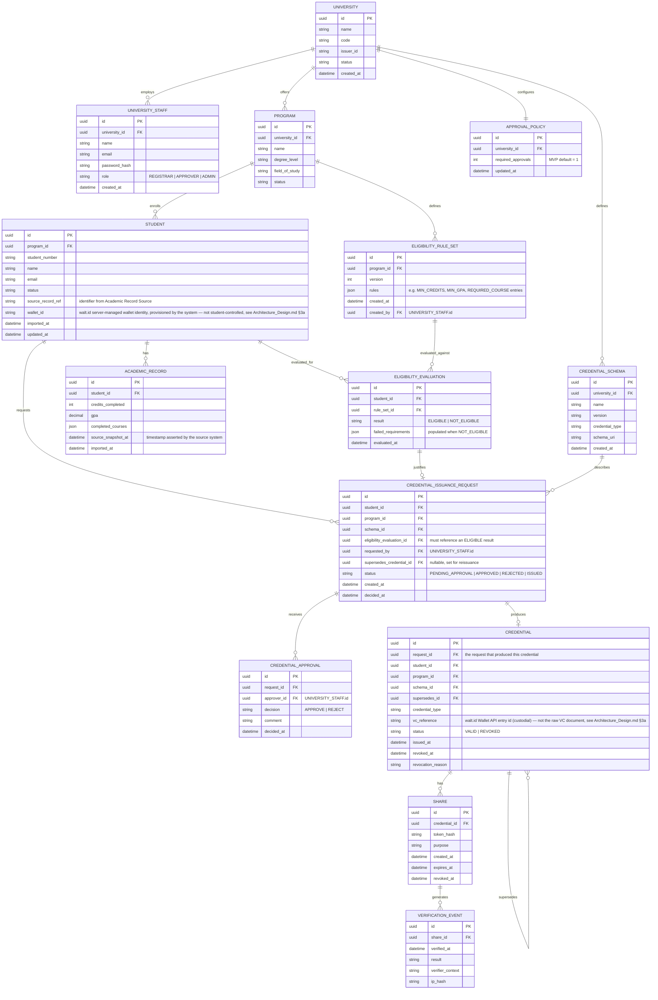

# Data Model

**Version:** 2.0

Supports `docs/01-requirements/SRS.md` (v2.0) Section 7. Reflects three cumulative changes from the original draft:

1. **Single tenant.** `UNIVERSITY` is a singleton table (one row, seeded at deployment). No cross-university foreign keys exist anywhere else in the model.
2. **Approval workflow.** Issuance goes through `CREDENTIAL_ISSUANCE_REQUEST` and `CREDENTIAL_APPROVAL` before a `CREDENTIAL` row is created, governed by `APPROVAL_POLICY`.
3. **Academic record import & eligibility (new in v2.0).** `STUDENT` and `ACADEMIC_RECORD` are populated only from the external Academic Record Source (never hand-authored by a Registrar); each `PROGRAM` carries a versioned `ELIGIBILITY_RULE_SET`, and a student's `ELIGIBILITY_EVALUATION` against that rule set gates whether a `CREDENTIAL_ISSUANCE_REQUEST` can even be created.

---

## 1. ERD



## 2. Notes on Changes from v1.0 → v2.1

- **`STUDENT` and `ACADEMIC_RECORD` are import-only tables.** There is no Registrar-facing "create student" write path (see `API_Specification.md` Section 4) — every row traces back to a `source_record_ref` from the Academic Record Source, which is what makes AS-01 ("source data trusted as correct") an enforceable data-layer boundary rather than just a policy note. `ACADEMIC_RECORD` keeps `source_snapshot_at` separate from `imported_at` so the model distinguishes "when the source system asserted this was true" from "when UniDipVeri received it."
- **`ELIGIBILITY_RULE_SET` is versioned per program**, and `ELIGIBILITY_EVALUATION` stores a foreign key to the specific version it ran against (not just to `PROGRAM`). This directly implements FR-ELIG-10: editing a program's rules later does not retroactively change what an old evaluation (or a credential issued off it) meant.
- **`CREDENTIAL_ISSUANCE_REQUEST.eligibility_evaluation_id` is a hard link, not just an audit trail entry.** The application layer must reject request creation (`API_Specification.md` Section 6) unless this links to an evaluation whose `result = ELIGIBLE`; the foreign key exists so that fact is also checkable directly from the data, not only through application logic.
- **`UNIVERSITY` remains a singleton**, `CREDENTIAL_ISSUANCE_REQUEST`/`CREDENTIAL_APPROVAL`/`APPROVAL_POLICY` are unchanged from the v2.0 approval-workflow design — see prior notes, still valid.
- **Full NFR-06 traceability chain is now:** `ACADEMIC_RECORD` (imported) → `ELIGIBILITY_EVALUATION` (computed) → `CREDENTIAL_ISSUANCE_REQUEST` (created only if eligible) → `CREDENTIAL_APPROVAL` (one or more) → `CREDENTIAL` (issued). Every arrow is a foreign key, so the chain is reconstructable with joins alone, without relying on a separately-maintained audit log agreeing with the transactional tables.

## 3. Application-Level Credential Representation

Unchanged from v1 — the schema referenced by `CREDENTIAL_SCHEMA` (`MIUAcademicDiplomaCredential/v1`):

```
AcademicDiplomaCredential
│
├── issuer
│   ├── id
│   └── name
│
├── credentialSubject
│   ├── id
│   ├── name
│   ├── studentNumber
│   ├── degree
│   ├── program
│   ├── fieldOfStudy
│   ├── degreeLevel
│   └── awardDate
│
└── credentialStatus
```

```json
{
    "credentialType": "AcademicDiploma",
    "schemaVersion": "1.0",
    "issuer": "Mekong International University",
    "subject": {
        "name": "Nguyen Minh Anh",
        "studentNumber": "MIU2026-001",
        "degree": "Bachelor of Computer Science",
        "program": "Computer Science",
        "fieldOfStudy": "Computer Science",
        "degreeLevel": "Bachelor",
        "awardDate": "2026-06-15"
    }
}
```

Note what is deliberately _not_ in this payload: `ACADEMIC_RECORD` details (GPA, course list) and `ELIGIBILITY_EVALUATION` results. Those justify _why_ the credential was issued but are not part of the credential subject itself and are never sent to walt.id or exposed on the public verification page (SRS NFR-02, NFR-07).
