# Sequence Diagrams — UniDipVeri

**Version:** 0.1.0

Companion to `docs/01-requirements/SRS.md`, `docs/01-requirements/Use_Cases.md`, `docs/02-analysis/DFD.md`, `docs/03-design/Architecture_Design.md`, and `docs/03-design/Class_Diagram.md`. Where the Activity Diagrams show control flow and decision points, these diagrams show **object interaction over time** — which layer calls which, in what order, and what each call returns — down to the Application Service, Repository Port, and Adapter names used in the class diagram. All diagrams are Mermaid `sequenceDiagram`s.

**Participant conventions used throughout:**

- `actor` blocks are human/external actors (Registrar, Approver, Admin, Student, Verifier, Academic Record Source).
- `Controller` participants are thin Presentation-layer classes (§6 of `Class_Diagram.md`).
- Application Service participants (`StaffService`, `StudentWalletService`, `AcademicRecordService`, `EligibilityService`, `IssuanceRequestService`, `CredentialService`, `ShareService`, `VerificationService`, `AuditService`) match §4 of `Class_Diagram.md`.
- Repository/Port participants (`IStaffRepository`, `IStudentRepository`, etc.) represent calls through the Application Port interface; the concrete `Postgres*Repository` implementation is what actually runs, per §5.
- `WaltIdWalletAdapter` and `WaltIdVCAdapter` represent calls through `IWalletAdapter`/`IVCAdapter` to the `walt.id` infrastructure.
- **`AuthService`** is a small cross-cutting Application Service (not shown as a bounded-area box in `Class_Diagram.md` §4, since it has no domain state of its own) that implements FR-AUTH-01–04 for both staff and student sessions. It is called by every controller's authorization check but is only drawn explicitly in Diagrams 1 and 2.

---

## 1. Staff Login

**Traces to:** UC-01 · FR-AUTH-01, FR-AUTH-02, FR-AUTH-04

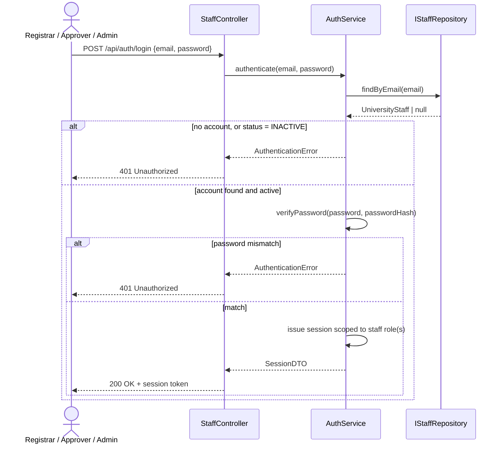

**Note:** No session is created on any failure branch. Every subsequent staff request re-checks role via `Auth` independent of session validity (FR-AUTH-04) — see the `alt` blocks for privileged actions in later diagrams.

---

## 2. Student Login

**Traces to:** UC-02 · FR-AUTH-03, FR-STU-04

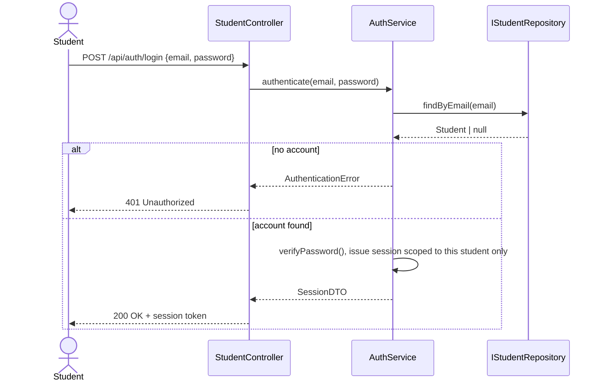

**Note:** The issued session is scoped to a single `studentId`; every later query (e.g. `GET /api/credentials`) is implicitly filtered to that student, enforcing FR-STU-04.

---

## 3. Import Academic Record → Wallet Provisioning → Eligibility Evaluation

**Traces to:** UC-03, UC-05, UC-21 · FR-STU-01–03, FR-ELIG-01–08, FR-WAL-01, AS-01

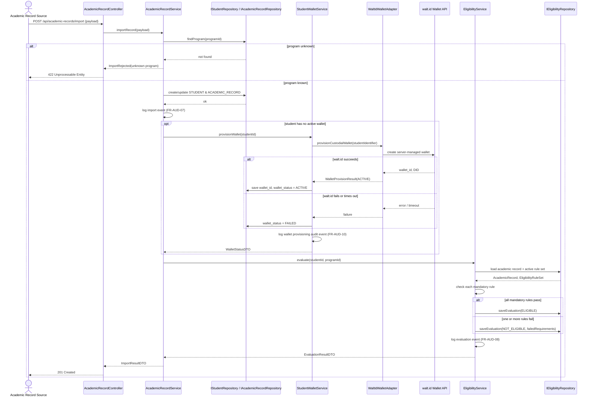

**Note:** This same sequence, entered directly at `ARS->>ES: evaluate(...)`, also covers a Registrar's manual "re-evaluate" action (UC-05's alternate trigger).

---

## 4. Manual Wallet Provisioning / Retry

**Traces to:** UC-21, UC-22 · FR-WAL-01, FR-WAL-02, FR-WAL-03, FR-AUD-10

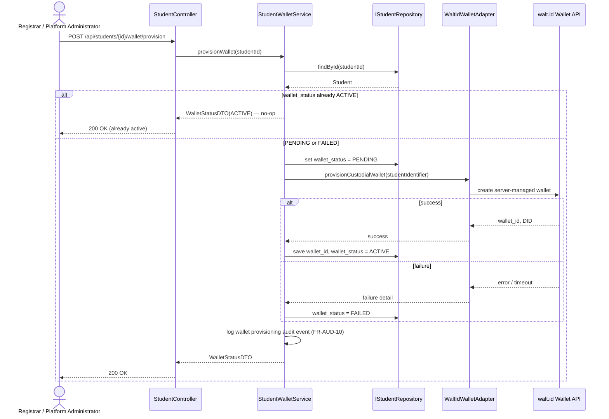

---

## 5. Create Issuance Request → Approve → Issue

**Traces to:** UC-07, UC-08, UC-10, UC-21 · FR-APPR-01–10, FR-CRED-01–06, FR-WAL-04

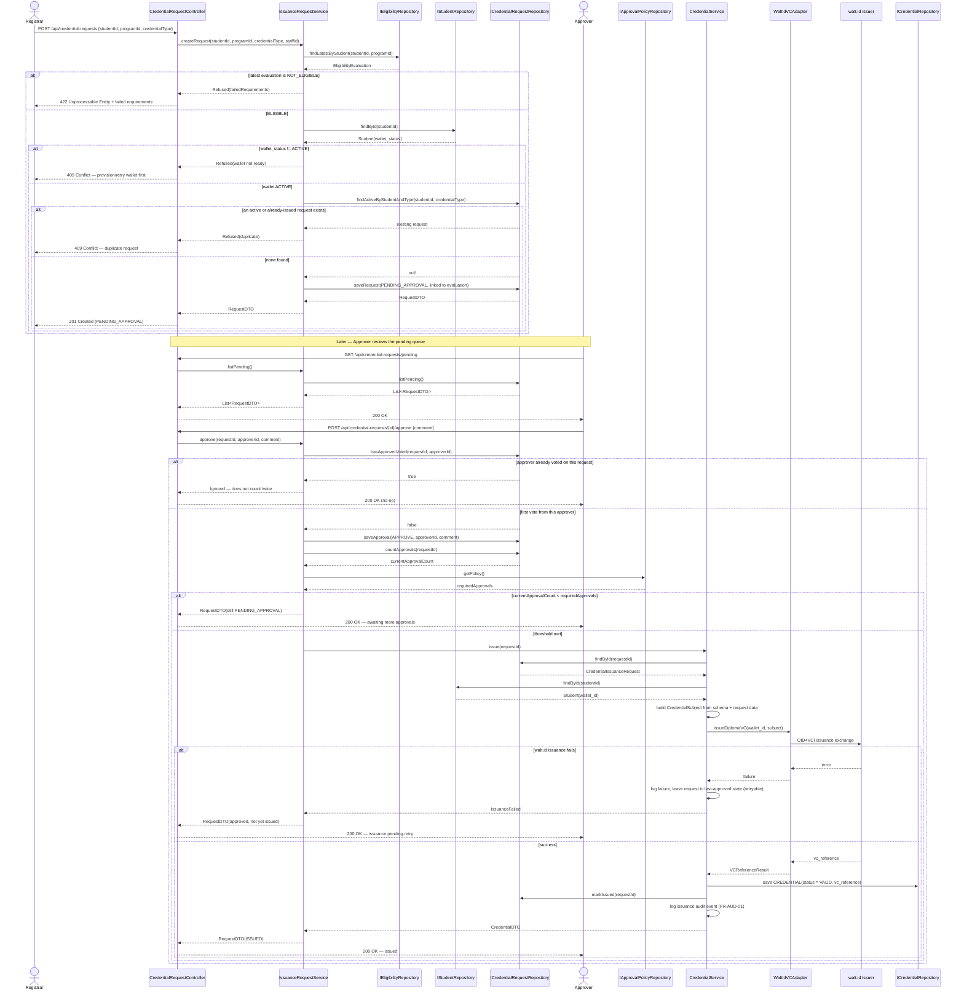

---

## 6. Reject Issuance Request

**Traces to:** UC-09 · FR-APPR-07, FR-APPR-08

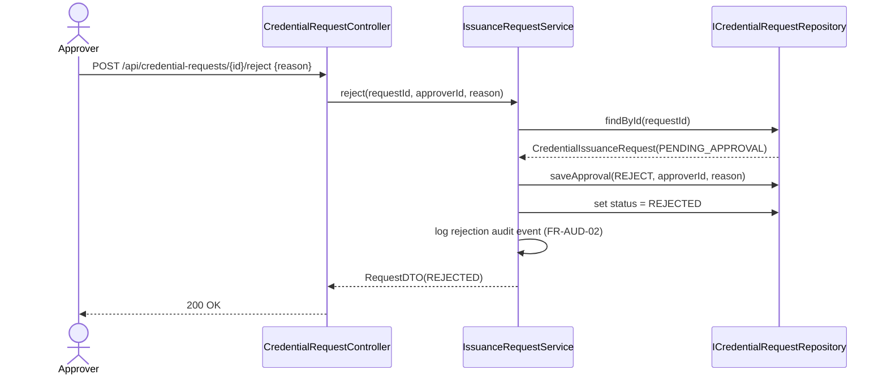

---

## 7. View Credential

**Traces to:** UC-11 · FR-CRED-07, FR-CRED-08, FR-STU-04

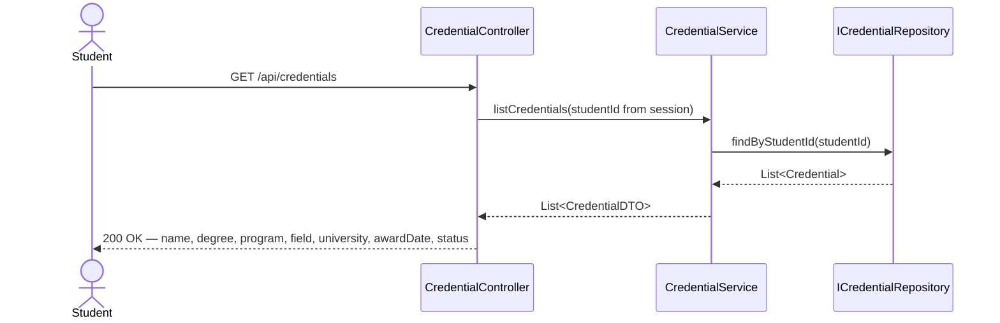

---

## 8. Create Verification Share

**Traces to:** UC-12 · FR-SHARE-01–04

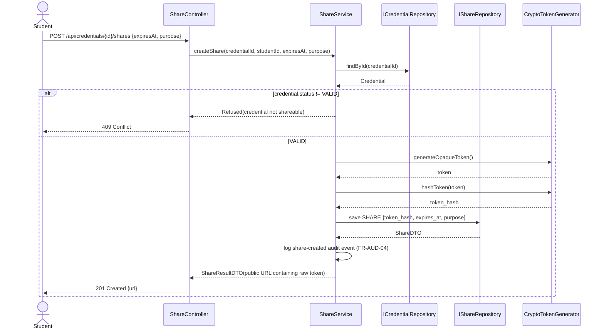

**Note:** Only `token_hash` is persisted; the raw token is returned once, in the URL, and never stored server-side — enforcing NFR-01's "opaque, unguessable share tokens."

---

## 9. Revoke Verification Share

**Traces to:** UC-13 · FR-SHARE-06, FR-SHARE-07

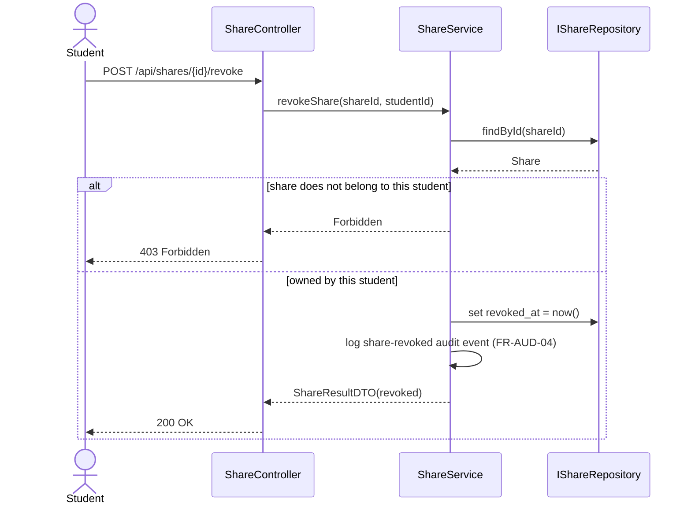

---

## 10. Public Verification

**Traces to:** UC-14 · FR-VER-01–08, FR-AUD-05, NFR-02, NFR-07

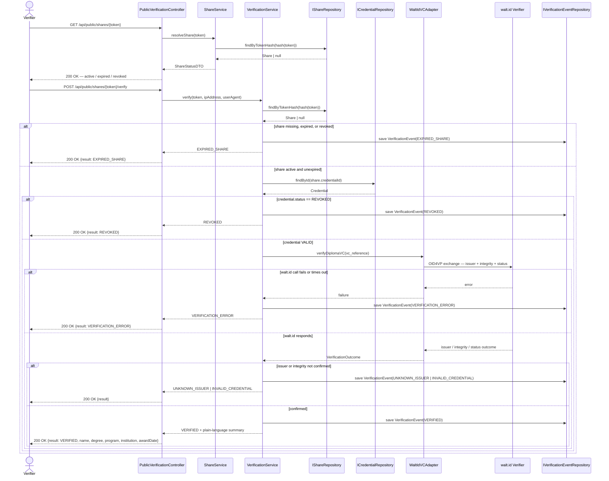

**Note (NFR-07 / trust boundary):** Nothing in this sequence re-checks grades, courses, or the eligibility decision — `VerificationService` only ever queries `Credential` and calls `IVCAdapter`, never `IEligibilityRepository` or `IAcademicRecordRepository`.

---

## 11. Revoke Credential

**Traces to:** UC-15 · FR-CRED-09–11

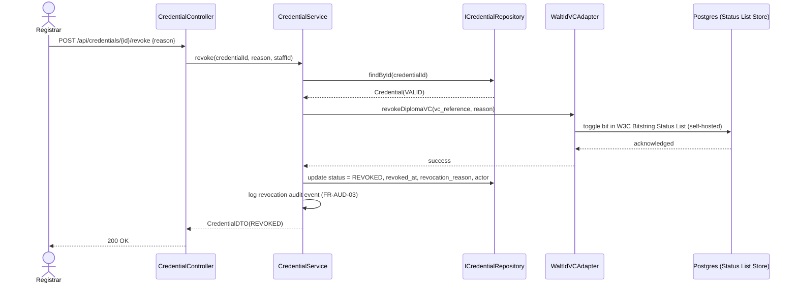

---

## 12. Reissue Credential

**Traces to:** UC-16 · FR-CRED-12–13, FR-ELIG-10

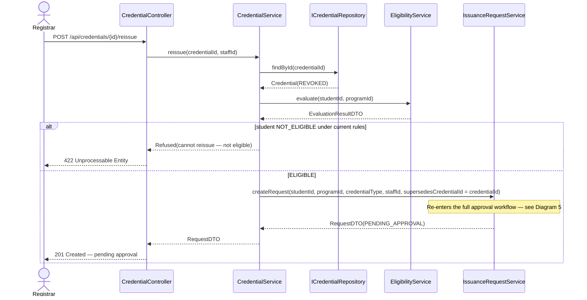

---

## 13. View Audit History

**Traces to:** UC-17 · FR-AUD-01–10, NFR-06

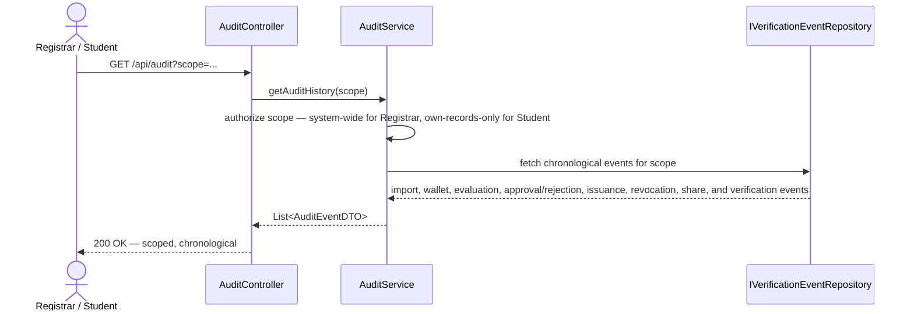

---

## 14. Staff User Management (Create / Update / Deactivate)

**Traces to:** UC-20 · FR-USER-01–03, FR-USER-05, FR-AUD-09

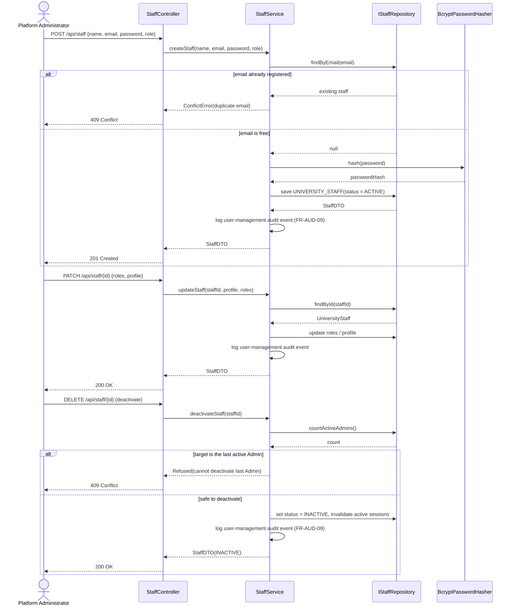

---

## 15. View & Manage Student Accounts

**Traces to:** UC-22 · FR-USER-04, FR-STU-02, FR-STU-03, FR-WAL-03

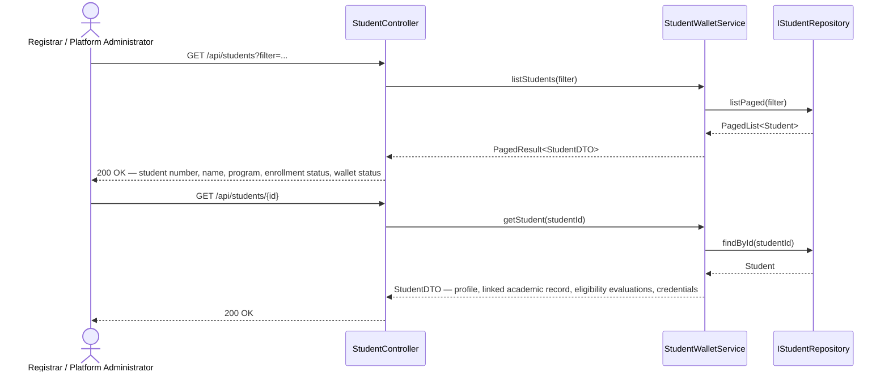

---

## 16. Diagram Cross-Reference

| Diagram                               | Use Cases                  | Key Requirements                              | Application Services Involved                                   |
| ------------------------------------- | -------------------------- | --------------------------------------------- | --------------------------------------------------------------- |
| 1. Staff Login                        | UC-01                      | FR-AUTH-01, FR-AUTH-02, FR-AUTH-04            | AuthService                                                     |
| 2. Student Login                      | UC-02                      | FR-AUTH-03, FR-STU-04                         | AuthService                                                     |
| 3. Import → Wallet → Eligibility      | UC-03, UC-05, UC-21        | FR-STU-01–03, FR-ELIG-01–08, FR-WAL-01, AS-01 | AcademicRecordService, StudentWalletService, EligibilityService |
| 4. Manual Wallet Provisioning / Retry | UC-21, UC-22               | FR-WAL-01–03, FR-AUD-10                       | StudentWalletService                                            |
| 5. Create Request → Approve → Issue   | UC-07, UC-08, UC-10, UC-21 | FR-APPR-01–10, FR-CRED-01–06, FR-WAL-04       | IssuanceRequestService, CredentialService                       |
| 6. Reject Issuance Request            | UC-09                      | FR-APPR-07, FR-APPR-08                        | IssuanceRequestService                                          |
| 7. View Credential                    | UC-11                      | FR-CRED-07, FR-CRED-08, FR-STU-04             | CredentialService                                               |
| 8. Create Verification Share          | UC-12                      | FR-SHARE-01–04                                | ShareService                                                    |
| 9. Revoke Verification Share          | UC-13                      | FR-SHARE-06, FR-SHARE-07                      | ShareService                                                    |
| 10. Public Verification               | UC-14                      | FR-VER-01–08, FR-AUD-05, NFR-02, NFR-07       | ShareService, VerificationService                               |
| 11. Revoke Credential                 | UC-15                      | FR-CRED-09–11                                 | CredentialService                                               |
| 12. Reissue Credential                | UC-16                      | FR-CRED-12–13, FR-ELIG-10                     | CredentialService, EligibilityService, IssuanceRequestService   |
| 13. View Audit History                | UC-17                      | FR-AUD-01–10, NFR-06                          | AuditService                                                    |
| 14. Staff User Management             | UC-20                      | FR-USER-01–03, FR-USER-05, FR-AUD-09          | StaffService                                                    |
| 15. View & Manage Student Accounts    | UC-22                      | FR-USER-04, FR-STU-02, FR-STU-03, FR-WAL-03   | StudentWalletService                                            |

Together, Diagrams 1–15 cover every use case in `Use_Cases.md` and every Application Service defined in `Class_Diagram.md` §4, showing the same workflows as `Activity_Diagrams.md` at the object-interaction level rather than the control-flow level.
