# UI/UX Design Specification

**Version:** 0.1.0

**Companion Documents:** `docs/01-requirements/SRS.md` · `docs/01-requirements/Use_Cases.md` · `docs/01-requirements/User_Stories.md` · `docs/04-api/API_Specification.md`

---

## 1. Overview & UX Design Principles

The UniDipVeri user interface is designed around simplicity, clarity, privacy preservation, and trust transparency. The user experience is split into two primary portals:

1. **Student Portal (Authenticated):** A self-service portal where graduates view issued diploma credentials, generate time-bounded share links, monitor verification activity, and manage their credentials.
2. **Public Verification Portal (Zero-Auth):** A lightweight, unauthenticated web interface for employers and third-party verifiers to verify academic credentials instantly without account creation or onboarding friction.

### Core Design Principles

- **Zero-Friction Verification:** Verifiers never need to sign up, install apps, or configure cryptographic keys. Verification is performed by navigating directly to a share URL.
- **Trust Boundary Transparency (SRS NFR-07):** Every verification screen clearly informs the verifier that the system attests to the cryptographic authenticity and revocation status of the diploma issued by the university, and is not a real-time re-assessment of current academic performance.
- **Privacy & Noise Isolation (SRS FR-VER-09):** Share links are opaque and reveal no internal IDs. Verification failures caused by invalid, expired, or revoked share links present a clear reason without exposing private graduate details.
- **Consistent Status Language:** Statuses use standard, high-contrast badges:
  - VALID / VERIFIED (Green) — Credential is authentic and active.
  - REVOKED / UNAVAILABLE (Red) — Credential or share link has been revoked.
  - EXPIRED (Yellow/Amber) — Share link validity window has elapsed.
  - UNAVAILABLE / NOT FOUND (Slate/Grey) — Non-existent share link.

---

## 2. Student Portal Interface

### 2.1 Authentication & Password Recovery

The Student Portal entry point enforces strict tenant and role boundaries. Access is restricted to university-issued student email addresses (`@student.miu.example`).

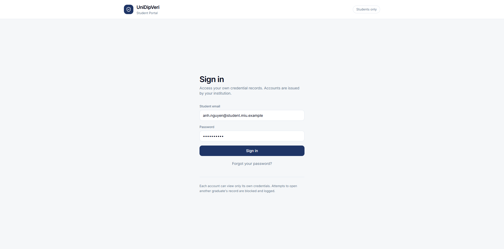
*Figure 2.1: Student Sign-in Page (`student-login.png`)*

- **Single Sign-On / Credential Login:** Students enter their student email and password.
- **Access Boundary Notice:** An explicit security reminder informs students that accounts can only view their own credentials and unauthorized access attempts are logged.
- **Password Recovery:** Students can request a single-use password reset link delivered to their student email.

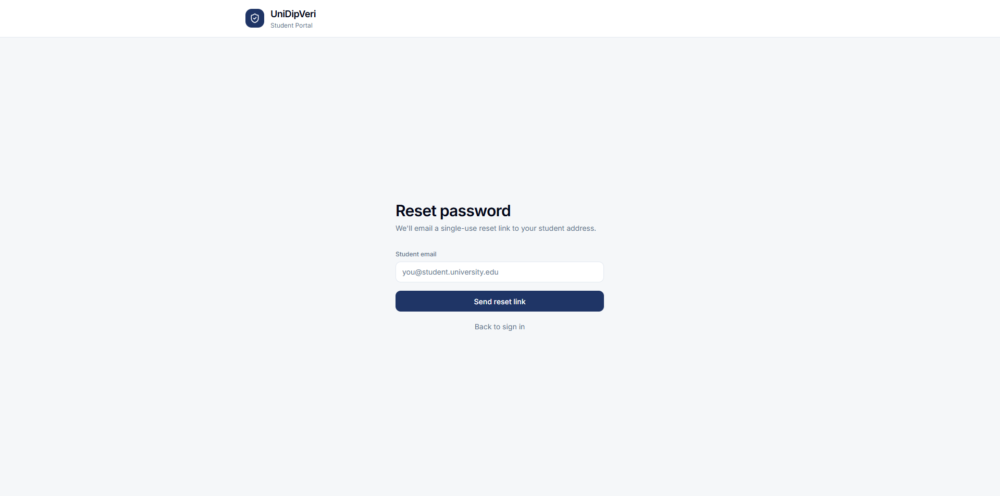
*Figure 2.2: Password Reset Page (`student-reset-pass.png`)*

---

### 2.2 Credentials Dashboard

The main student dashboard (`/api/me/credentials`) provides a consolidated view of all academic diplomas issued to the student.

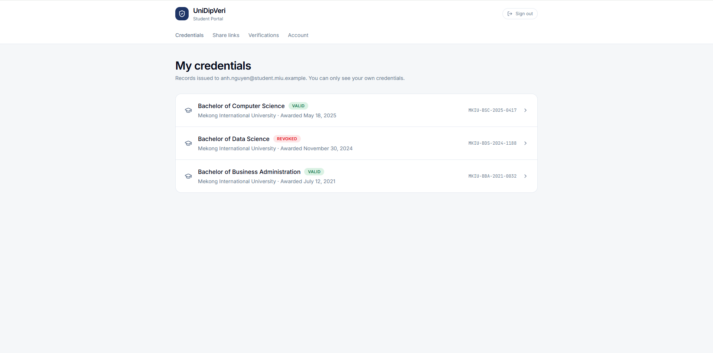
*Figure 2.3: My Credentials Dashboard (`student-dashboard.png`)*

- **Credential Cards:** Each credential displays degree title (e.g., *Bachelor of Computer Science*), institution name, award date, unique credential reference ID (e.g., `MKIU-BSC-2025-0417`), and real-time status (`VALID` or `REVOKED`).
- **Global Navigation Bar:** Clean top bar with navigation tabs: `Credentials`, `Share links`, `Verifications`, and `Account`, alongside a one-click `Sign out` action.

---

### 2.3 Share Link Management

Students generate and manage time-limited public verification links from the **Share links** view (`/api/me/shares`).

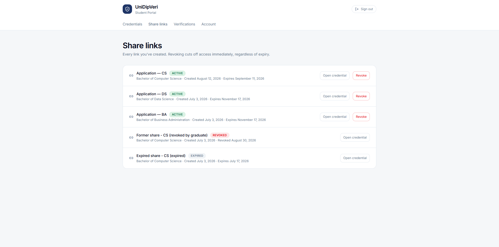
*Figure 2.4: Share Links Management View (`student-share-links.png`)*

- **Labeling & Metadata:** Each share entry lists a custom purpose/label (e.g., `Application — CS`), linked credential title, creation date, and expiration date.
- **Immediate Revocation:** Students can click **Revoke** at any time to instantly cut off access, rendering the share link inactive regardless of the original expiration date (`FR-SHARE-06`).
- **Status Filter:** Clearly separates active (`ACTIVE`), revoked (`REVOKED`), and expired (`EXPIRED`) shares.

---

### 2.4 Verification Events Activity/History

Accessible via the **Verifications** tab (`/api/me/verification-events`), this view presents graduates with a consolidated audit summary of how their share links have been verified by employers and third parties.

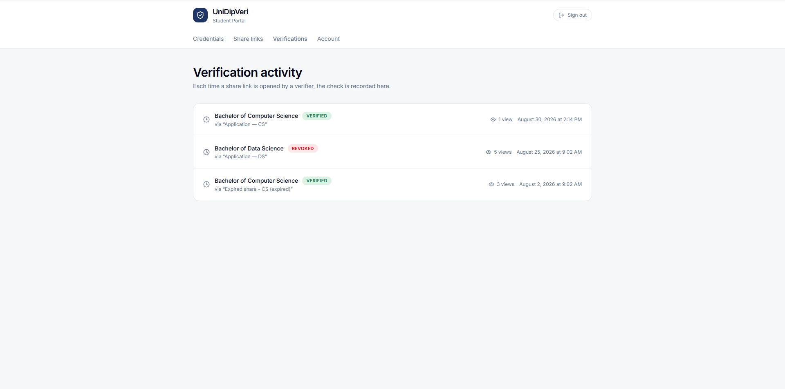
*Figure 2.5: Student Verification Events View (`student-verification-events.png`)*

- **Grouped by Share Link (SRS FR-AUD-05a):** Rather than exposing an overwhelming flood of raw request logs, events are aggregated per share link.
- **Verification Metrics:** Displays the linked degree, purpose label, latest outcome (`VERIFIED`, `REVOKED`), total attempt count, and the most recent verification timestamp.
- **Noise Filtering (SRS FR-VER-09):** Verification attempts against invalid, expired, or revoked share links (`NOT_FOUND_SHARE`, `EXPIRED_SHARE`, `REVOKED_SHARE`) are excluded at write time to prevent log pollution.

---

### 2.5 Account Management

Students can review basic profile details and update their credentials via the **Account** tab (`/api/me`).

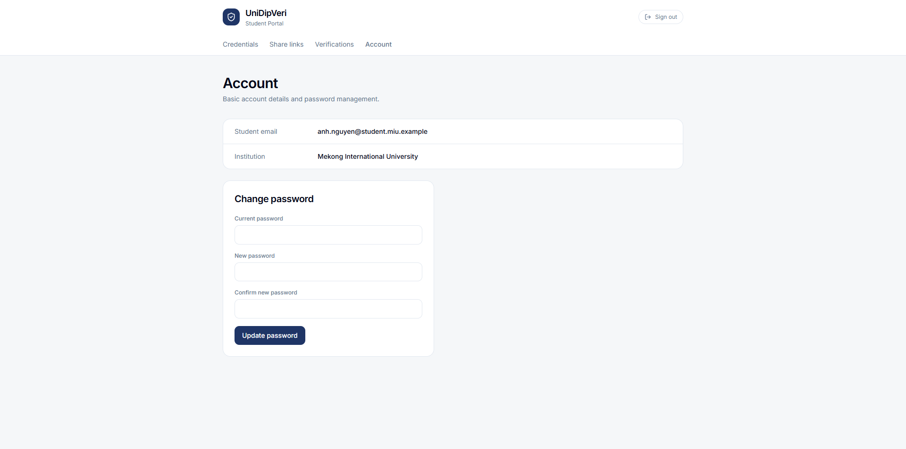
*Figure 2.6: Student Account Management View (`student-acc-manage.png`)*

- **Profile Summary:** Displays registered student email address and affiliated institution.
- **Password Update Form:** Allows safe updating of the student portal password requiring current password validation.

---

## 3. Public Verifier Interface (Zero-Auth Portal)

When a third-party verifier opens a valid share link, the system presents a clean, plain-language summary of the credential verification without exposing raw cryptographic JSON/JWT structures.

### 3.1 Verified Academic Diploma

When the share token is valid, active, and the cryptographic VC verification succeeds, the verifier is presented with the verified credential summary.

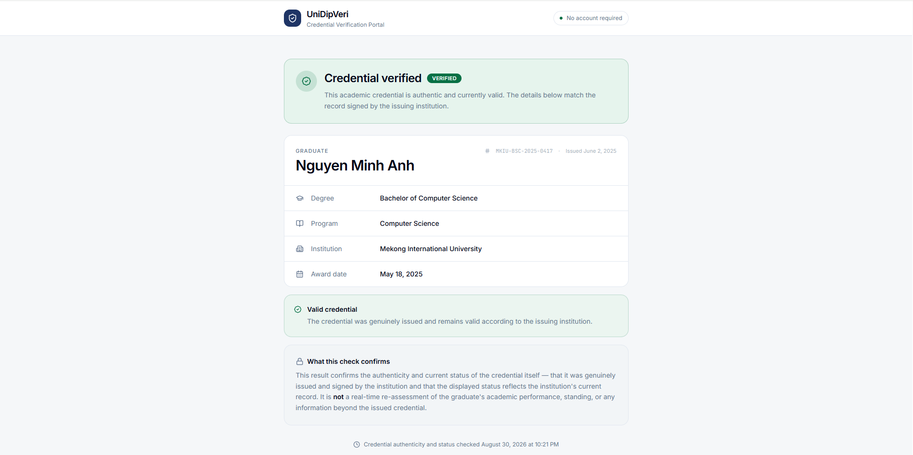
*Figure 3.1: Verified Credential Result (`verifier-verified.png`)*

- **Status Banner:** Prominent green **Credential verified** (`VERIFIED`) header confirming authenticity and active standing.
- **Graduate & Award Information:** Graduate name, degree title, academic program, issuing institution, award date, credential identifier, and issuance timestamp.
- **Trust Boundary Disclaimer:** Clarifies that the verification attests to credential authenticity and status as signed by the institution, not real-time academic standing or live performance.

---

### 3.2 Revoked Academic Diploma

If the underlying diploma has been rescinded or revoked by the university registrar, the verification portal clearly alerts the verifier.

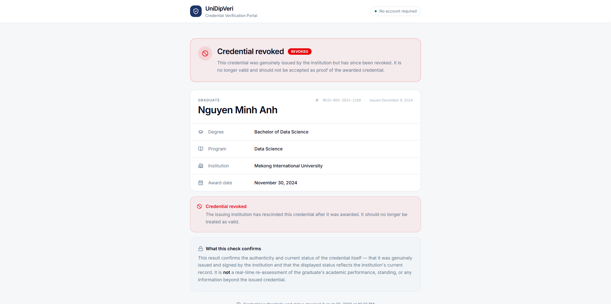
*Figure 3.2: Revoked Credential Result (`verifier-revoked.png`)*

- **Revocation Warning Banner:** High-visibility red banner stating that the credential was genuinely issued by the institution but has since been revoked and should not be accepted as proof of award.
- **Historical Attribution:** Displays the original degree and graduate details for identification while maintaining the clear `REVOKED` badge.

---

### 3.3 Share Link Edge Cases & Quick-Exits

When a share link cannot be used, the system returns a designated quick-exit state without revealing underlying private credential data or persisting spurious verification events (SRS FR-VER-09).

#### A. Share Link Not Found (`NOT_FOUND_SHARE`)

When a verifier navigates to an invalid or non-existent token:

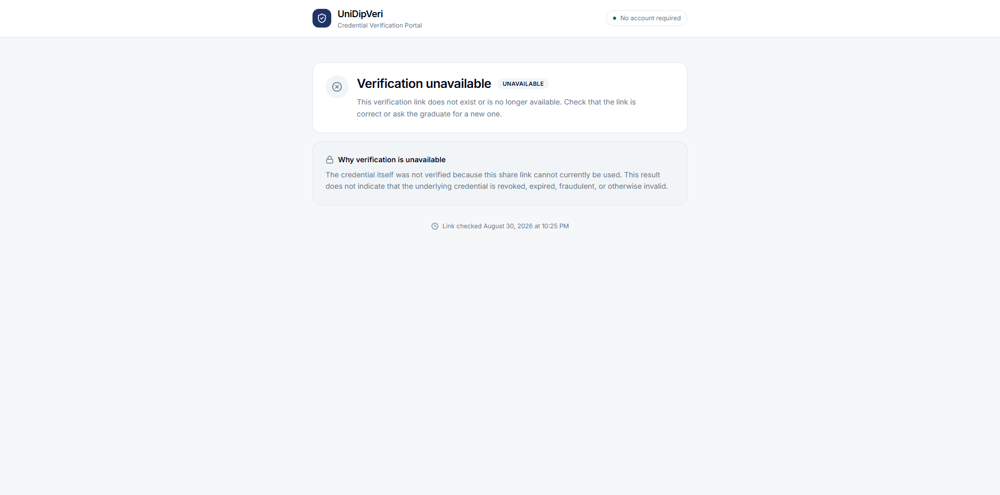
*Figure 3.3: Verification Unavailable / Link Not Found (`verifier-link-not-found.png`)*

- **Friendly Error Guidance:** Explains that the verification link does not exist or is no longer available, prompting the verifier to check the URL or request a new link from the graduate.

---

#### B. Share Link Expired (`EXPIRED_SHARE`)

When a share URL is accessed after its configured `expiresAt` timestamp:

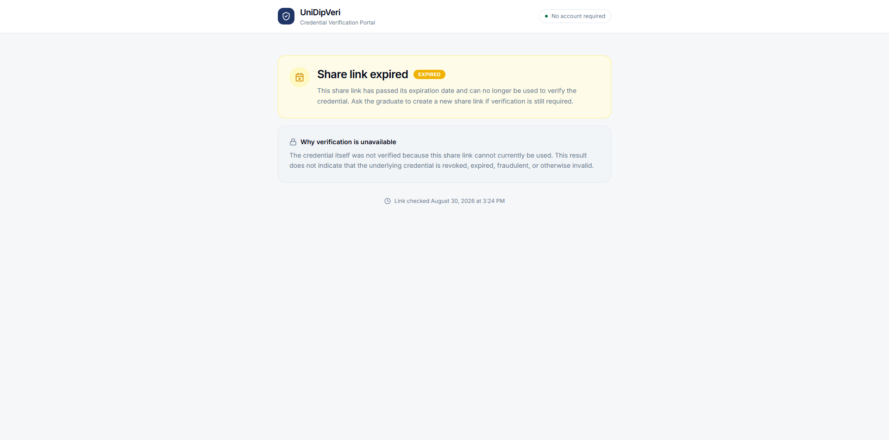
*Figure 3.4: Share Link Expired (`verifier-link-expired.png`)*

- **Amber Expiration Notice:** Informs the verifier that the share validity window has elapsed and instructs them to request a fresh link from the candidate.

---

#### C. Share Link Revoked by Student (`REVOKED_SHARE`)

When a student has explicitly revoked an active share link:

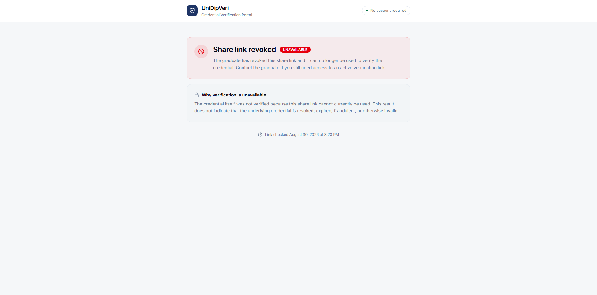
*Figure 3.5: Share Link Revoked by Graduate (`verifier-link-revoked.png`)*

- **Revoked Share Notice:** Explicitly indicates that the graduate has revoked access to this specific link, distinguishing link revocation from credential revocation.
- **Neutral Disclaimer:** Reassures the verifier that share link unavailability does not imply the underlying diploma is invalid or fraudulent.

---

## 4. UI/UX Mapping to Functional Requirements

| Screen / Component | Asset File | Route / Endpoint | Traces to Requirements |
| :--- | :--- | :--- | :--- |
| Student Sign In | `student-login.png` | `POST /api/auth/login` | FR-AUTH-01, FR-STU-04 |
| Password Reset | `student-reset-pass.png` | `POST /api/auth/reset-password` | FR-AUTH-01 |
| Credentials Dashboard | `student-dashboard.png` | `GET /api/me/credentials` | FR-CRED-07, FR-CRED-08 |
| Share Links Management | `student-share-links.png` | `GET /api/me/shares` | FR-SHARE-01–07 |
| Verification Events History | `student-verification-events.png` | `GET /api/me/verification-events` | FR-AUD-05, FR-AUD-05a, US-I2 |
| Account Management | `student-acc-manage.png` | `GET /api/me` | FR-STU-04 |
| Verified Credential View | `verifier-verified.png` | `POST /api/public/shares/{token}/verify` | FR-VER-01–08 |
| Revoked Credential View | `verifier-revoked.png` | `POST /api/public/shares/{token}/verify` | FR-VER-06, FR-VER-07 |
| Missing Share Quick-Exit | `verifier-link-not-found.png`| `GET /api/public/shares/{token}` | FR-VER-02, FR-VER-07, FR-VER-09 |
| Expired Share View | `verifier-link-expired.png` | `POST /api/public/shares/{token}/verify` | FR-SHARE-05, FR-VER-07, FR-VER-09 |
| Revoked Share View | `verifier-link-revoked.png` | `POST /api/public/shares/{token}/verify` | FR-SHARE-06, FR-VER-07, FR-VER-09 |
