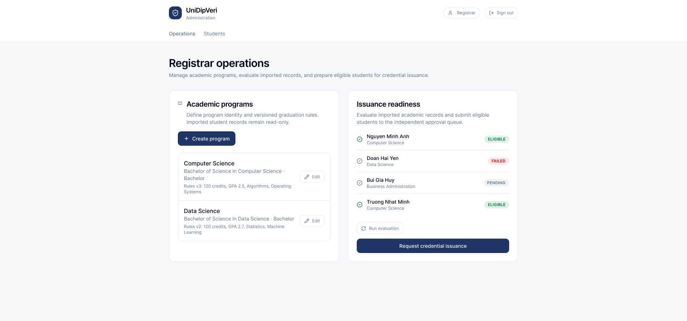
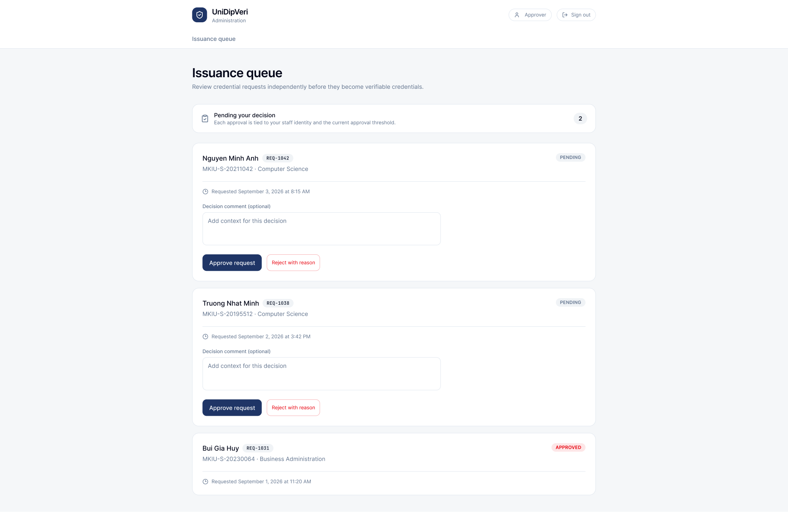
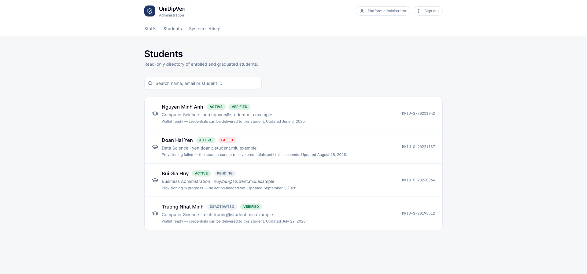
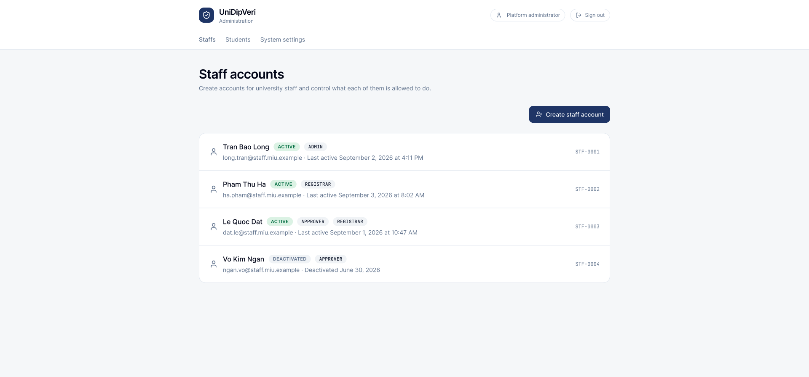
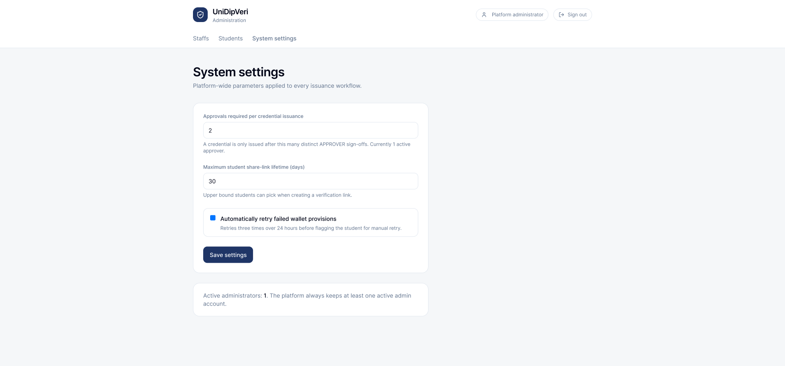

<!-- markdownlint-disable MD033 -->

# UI/UX Design Specification

**Version:** 0.2.0

**Companion Documents:** `docs/01-requirements/SRS.md` · `docs/01-requirements/Use_Cases.md` · `docs/01-requirements/User_Stories.md` · `docs/04-api/API_Specification.md` · `docs/03-design/Data_Model.md`

---

## 1. Overview & UX Design Principles

The UniDipVeri user interface is designed around simplicity, clarity, privacy preservation, and strict institutional trust transparency. The user experience is organized into three primary operational portals served by a unified authentication core:

1. **Unified Authentication & Account Core:** A shared authentication and personal profile management suite used uniformly by all user roles (Students, Registrars, Approvers, and Platform Administrators).
2. **Student Portal (Authenticated):** A self-service portal where graduates view issued diploma credentials, generate time-bounded share links, monitor third-party verification activity, and manage their personal credentials.
3. **Staff & Administration Portal (Role-Gated):** An operational workspace tailored by institutional role for Registrars (academic programs, graduation eligibility evaluation, issuance requests), Approvers (independent issuance review and signing), and Platform Administrators (student directory oversight, staff provisioning, and system policies).
4. **Public Verification Portal (Zero-Auth):** A lightweight, unauthenticated web interface for employers and third-party verifiers to verify academic credentials instantly without account creation or onboarding friction.

### Core Design Principles

- **Zero-Friction Verification:** Verifiers never need to sign up, install apps, or configure cryptographic keys. Verification is performed by navigating directly to a share URL.
- **Trust Boundary Transparency (SRS NFR-07):** Every verification screen clearly informs the verifier that the system attests to the cryptographic authenticity and revocation status of the diploma issued by the university, and is not a real-time re-assessment of current academic performance.
- **Read-Only External Ingestion Boundary (SRS AS-01, US-B3):** Student directories and academic achievement data are strictly read-only to human staff in the UI. Registrars cannot manually create students or alter transcript records, ensuring external Student Information System (SIS) records remain uncompromised.
- **Privacy & Noise Isolation (SRS FR-VER-09):** Share links are opaque and reveal no internal database IDs. Verification failures caused by invalid, expired, or revoked share links present a clear quick-exit reason without exposing private graduate details or polluting audit logs.
- **Consistent Status Language:** Statuses use standard badges across all screens:
  - 🟢 **ACTIVE · VERIFIED · VALID · ELIGIBLE** — Credential, rule, or student is authentic, active, or qualified.
  - 🔴 **REVOKED · DEACTIVATED · FAILED · REJECTED** — Entity has been rescinded, deactivated, failed validation, or rejected.
  - 🟡 **EXPIRED · PENDING** — Share link validity has elapsed, or an evaluation/approval is pending.
  - ⚪ **UNAVAILABLE · NOT FOUND** — The share link does not exist or cannot be resolved.

---

## 2. Unified Authentication & Account Management (Shared Across All Roles)

To prevent duplication and maintain architectural consistency, **all four system roles (Student, Registrar, Approver, Platform Administrator) share the exact same authentication and account management pages**.

### 2.1 Unified Sign-In Page

The primary sign-in interface serves as the universal entry point for both university staff and students.

*Figure 2.1: Unified Sign-in Page (`student-login.png`)*

- **Unified Authentication Endpoint (`POST /api/auth/login`):** Users enter their institutional email (`@student.miu.example` or `@staff.miu.example`) and password.
- **Automated Role Dispatching:** Upon successful credential verification, the standalone `AuthService` issues a signed JWT containing the user's role claims (`STUDENT`, `REGISTRAR`, `APPROVER`, or `ADMIN`). The frontend router automatically routes the user to their authorized destination:
  - `STUDENT` &rarr; Student Credentials Dashboard (`/credentials`)
  - `REGISTRAR` &rarr; Registrar Operations Console (`/operations`)
  - `APPROVER` &rarr; Issuance Queue Review (`/issuance-queue`)
  - `ADMIN` &rarr; Staff & Administration Suite (`/admin/staffs`)
- **First-Time User Onboarding:** Newly imported students (`account_status = PENDING_ACTIVATION`) and newly provisioned staff members use this same portal to establish their initial password, automatically activating their account upon first login.
- **Access Boundary Notice:** A security reminder reinforces that accounts can only view authorized records and all access attempts are logged for audit compliance.

---

### 2.2 Password Recovery & First-Time Activation

*Figure 2.2: Password Reset & Activation Page (`student-reset-pass.png`)*

- **Unified Password Reset Flow (`POST /api/auth/reset-password`):** Accessible via "Forgot your password?" on the login page.
- **Secure Token Delivery:** Users enter their registered institutional email to receive a single-use, time-limited reset/activation link.
- **Self-Service Recovery:** Applicable equally to graduates recovering lost credentials and university staff updating credentials without administrator intervention.

---

### 2.3 Shared Personal Account Management

All authenticated users — regardless of whether they are a student or a staff member — manage their personal profile details and password through the shared **Account** view (`/api/me`).

*Figure 2.3: Shared Account Management View (`student-acc-manage.png`)*

- **Profile Summary:** Displays the authenticated user's registered institutional email, affiliated institution (*Mekong International University*), and active assigned role.
- **Password Update Form (`POST /api/auth/change-password`):** Provides a standardized interface requiring:
  1. Current password verification.
  2. New password input meeting institutional complexity requirements.
  3. New password confirmation.
- **Immediate Invalidation:** Password updates update `password_hash` and immediately invalidate existing session tokens across devices.

---

## 3. Student Portal Interface

The Student Portal gives graduates complete sovereign control over viewing their credentials, generating share links, and reviewing third-party verification activity.

### 3.1 Credentials Dashboard

The main student dashboard (`/api/me/credentials`) provides a consolidated view of all academic diplomas issued to the student.

*Figure 3.1: My Credentials Dashboard (`student-dashboard.png`)*

- **Credential Cards:** Each credential card displays degree full title (e.g., *Bachelor of Computer Science*), issuing institution (*Mekong International University*), award date, unique credential reference ID (e.g., `MKIU-BSC-2025-0417`), and real-time cryptographic status (`VALID` or `REVOKED`).
- **Global Navigation Bar:** Clean top bar with navigation tabs: `Credentials`, `Share links`, `Verifications`, and `Account`, alongside a one-click `Sign out` action.

---

### 3.2 Share Link Management

Graduates generate and manage time-limited public verification links from the **Share links** view (`/api/me/shares`).

*Figure 3.2: Share Links Management View (`student-share-links.png`)*

- **Custom Purpose Labeling:** Each share entry lists a custom purpose/label (e.g., `Application — CS`), linked credential title, creation date, and expiration date.
- **Immediate Revocation (`FR-SHARE-06`):** Students can click **Revoke** at any time to instantly cut off access, rendering the share link inactive regardless of the original expiration date.
- **Status Filter:** Clearly separates active (`ACTIVE`), revoked (`REVOKED`), and expired (`EXPIRED`) shares.

---

### 3.3 Verification Events Activity / History

Accessible via the **Verifications** tab (`/api/me/verification-events`), this view presents graduates with a consolidated audit summary of how their share links have been verified by employers and third parties.

*Figure 3.3: Student Verification Events View (`student-verification-events.png`)*

- **Grouped by Share Link (SRS FR-AUD-05a):** Rather than exposing an overwhelming flood of raw request logs, events are aggregated per share link.
- **Verification Metrics:** Displays the linked degree, purpose label, latest outcome (`VERIFIED`, `REVOKED`), total attempt count, and the most recent verification timestamp.
- **Noise Filtering (SRS FR-VER-09):** Verification attempts against invalid, expired, or revoked share links (`NOT_FOUND_SHARE`, `EXPIRED_SHARE`, `REVOKED_SHARE`) are excluded at write time to prevent log pollution.

---

## 4. Staff & Administration Portal Interfaces

The Staff & Administration Portal provides dedicated, role-tailored consoles for managing programs, evaluating graduation eligibility, approving credential issuance, overseeing student cohorts, and configuring system-wide governance.

### 4.1 Registrar Operations Console

Designed for users holding the `REGISTRAR` role, this console unifies program curriculum definitions with graduation readiness evaluation.

*Figure 4.1: Registrar Operations Console (`registrar-op.png`)*

- **Academic Programs Card (`FR-PROG-01..04`):**
  - Displays configured academic programs with name, degree full title, degree level, and active rule-set version (e.g., *Computer Science · Bachelor of Science in Computer Science · Rules v3: 120 credits, GPA 2.5, Algorithms, Operating Systems*).
  - **Create / Edit Program:** Enables creating new programs (`+ Create program`) or editing details and eligibility rules (`Edit`).
  - **Explicit Ingestion Boundary Reminder:** Clearly states: *"Imported student records remain read-only,"* preventing accidental manual tampering with academic achievement facts.
- **Issuance Readiness & Batch Evaluation Card (`FR-ELIG-01..09`, `FR-APPR-01`):**
  - Lists student cohort candidates with current graduation eligibility badges:
    - ELIGIBLE: Student satisfies all mandatory degree rules.
    - FAILED: Student fails one or more graduation requirements.
    - PENDING: Evaluation pending or record newly imported.
  - **Run Evaluation Action:** Triggers automated batch rule evaluations against student academic records.
  - **Request Credential Issuance Action:** Submits eligible students to the independent approver queue, transitioning the request state to `PENDING_APPROVAL`.

---

### 4.2 Approver Operations — Independent Issuance Queue

Designed for users holding the `APPROVER` role, this view enforces multi-party separation of duties by ensuring credentials cannot be issued without independent sign-off.

*Figure 4.2: Approver Issuance Queue View (`approver-op.png`)*

- **Queue Summary Banner:** Displays the total count of requests currently pending sign-off (*"Pending your decision — Each approval is tied to your staff identity and the current approval threshold"*).
- **Issuance Request Cards (`FR-APPR-04..09`):**
  - Displays graduate name, unique request ID badge (e.g., `REQ-1042`, `REQ-1038`), student ID number, academic program, and submission timestamp.
  - **Decision Context Form:** Includes an optional "Decision comment" input field to record rationale for audit compliance (`CREDENTIAL_APPROVAL.comment`).
  - **Dual Decision Actions:**
    - **Approve Request** (Primary Navy): Registers the approver's vote (`APPROVE`). If the vote satisfies the university's approval threshold $N$, the system immediately triggers cryptographic issuance via `walt.id`.
    - **Reject with Reason** (Red Outline): Rejects the issuance request (`REJECT`), halting issuance and recording the approver's rejection comment.
- **Historical Decisions Section:** Displays completed requests with finalized status badges (`APPROVED`, `REJECTED`).

---

### 4.3 Student Directory & Lifecycle Oversight

Accessible by both **Registrars** and **Platform Administrators** (`FR-USER-04`, `US-J4`), this screen provides cohort-level oversight of student profiles, account standing, and custodial wallet health.

*Figure 4.3: Student Directory Oversight View (`admin-student-acc-manage.png`)*

- **Read-Only Directory Banner (AS-01):** Reaffirms that student demographic and enrollment data is an authoritative, read-only mirror of the external SIS (*"Read-only directory of enrolled and graduated students"*).
- **Universal Search:** Search bar filtering across student name, student institutional email, and student ID number (`student_number`).
- **Student Profile Cards:**
  - **Dual Status Badges (`FR-USER-04`):**
    - Account Status: ACTIVE or DEACTIVATED.
    - Wallet Provisioning Status: VERIFIED / ACTIVE, PENDING, or FAILED.
  - **Explanatory Context:** Informs staff of wallet readiness (e.g., *"Wallet ready — credentials can be delivered to this student"* vs. *"Provisioning failed — the student cannot receive credentials until this succeeds"*).
- **Administrative Actions:**
  - **Retry Wallet Provisioning (`FR-WAL-02`, `US-K2`):** Allows staff to re-trigger custodial wallet generation on `walt.id` if a previous attempt failed.
  - **Account Deactivation / Reactivation (`US-J5`):** Allows deactivating a student account, which automatically cascades to deactivating the student's custodial wallet (`FR-WAL-05`).

---

### 4.4 Staff Account Management

Restricted exclusively to **Platform Administrators** (`FR-USER-01..05`, `US-J1..J3`), this console manages university staff accounts and internal security permissions.

*Figure 4.4: Staff Account Management View (`admin-staff-acc-manage.png`)*

- **Create Staff Action (`+ Create staff account`):** Modal dialog allowing administrators to provision new university staff by supplying name, institutional email (`@staff.miu.example`), and role assignments (`REGISTRAR`, `APPROVER`, `ADMIN`).
- **Staff Member Cards:**
  - Displays staff name, institutional email, unique staff identifier (e.g., `STF-0001`), and last active timestamp.
  - **Status Badge:** ACTIVE or DEACTIVATED.
  - **Assigned Role Pills:** Clear tags denoting permissions (`ADMIN`, `REGISTRAR`, `APPROVER`). A staff member may hold multiple roles (e.g., both `APPROVER` and `REGISTRAR`).
- **Deactivation with Audit Preservation (`US-J3`):** Staff accounts can be deactivated to block login while preserving historical foreign key references in approval queues, issuance requests, and rule creation logs.
- **Sole Administrator Protection (`FR-USER-05`, `US-J3`):** The system disables deactivation for the final remaining active administrator account.

---

### 4.5 System Settings & Issuance Governance

Restricted to **Platform Administrators**, this console configures platform-wide security, issuance policies, and automated worker parameters.

*Figure 4.5: System Settings & Policy Configuration View (`admin-system-conf.png`)*

- **Approvals Required per Credential Issuance (`FR-APPR-03`, `US-D1`):**
  - Sets the approval policy threshold $N$ (e.g., `2`). A credential is only minted and signed once $N$ distinct authorized Approvers submit approval decisions.
  - Live Approver Headcount: Displays the number of currently active approvers in the system to prevent setting an unreachable threshold.
- **Maximum Student Share-Link Lifetime (Days) (`FR-SHARE-05`):**
  - Configures the maximum validity window (e.g., `30` days) that students can select when generating verification links, preventing indefinite link exposure.
- **Automated Wallet Provisioning Retry Toggle (`US-K1`):**
  - Checkbox toggle: *"Automatically retry failed wallet provisions — Retries three times over 24 hours before flagging the student for manual retry."*
- **Active Administrators Quorum Indicator:**
  - Status alert: *"Active administrators: 1. The platform always keeps at least one active admin account,"* confirming system governance resilience.

---

## 5. Public Verifier Interface (Zero-Auth Portal)

When a third-party verifier (employer, background check service, or academic institution) opens a share link, the system presents a clean, plain-language summary of the credential verification without exposing raw cryptographic JSON/JWT structures.

### 5.1 Verified Academic Diploma

When the share token is valid, active, and the cryptographic VC verification succeeds, the verifier is presented with the verified credential summary.

*Figure 5.1: Verified Credential Result (`verifier-verified.png`)*

- **Status Banner:** Prominent green **Credential verified** (`VERIFIED`) header confirming authenticity and active standing.
- **Graduate & Award Information:** Graduate name, degree title, academic program, issuing institution, award date, credential identifier, and issuance timestamp.
- **Trust Boundary Disclaimer:** Clarifies that the verification attests to credential authenticity and status as signed by the institution, not real-time academic standing or live performance.

---

### 5.2 Revoked Academic Diploma

If the underlying diploma has been rescinded or revoked by the university registrar, the verification portal clearly alerts the verifier.

*Figure 5.2: Revoked Credential Result (`verifier-revoked.png`)*

- **Revocation Warning Banner:** High-visibility red banner stating that the credential was genuinely issued by the institution but has since been revoked and should not be accepted as proof of award.
- **Historical Attribution:** Displays the original degree and graduate details for identification while maintaining the clear `REVOKED` badge.

---

### 5.3 Share Link Edge Cases & Quick-Exits

When a share link cannot be used, the system returns a designated quick-exit state without revealing underlying private credential data or persisting spurious verification events (SRS FR-VER-09).

#### A. Share Link Not Found (`NOT_FOUND_SHARE`)

When a verifier navigates to an invalid or non-existent token:

*Figure 5.3: Verification Unavailable / Link Not Found (`verifier-link-not-found.png`)*

- **Friendly Error Guidance:** Explains that the verification link does not exist or is no longer available, prompting the verifier to check the URL or request a new link from the graduate.

---

#### B. Share Link Expired (`EXPIRED_SHARE`)

When a share URL is accessed after its configured `expiresAt` timestamp:

*Figure 5.4: Share Link Expired (`verifier-link-expired.png`)*

- **Amber Expiration Notice:** Informs the verifier that the share validity window has elapsed and instructs them to request a fresh link from the candidate.

---

#### C. Share Link Revoked by Student (`REVOKED_SHARE`)

When a student has explicitly revoked an active share link:

*Figure 5.5: Share Link Revoked by Graduate (`verifier-link-revoked.png`)*

- **Revoked Share Notice:** Explicitly indicates that the graduate has revoked access to this specific link, distinguishing link revocation from credential revocation.
- **Neutral Disclaimer:** Reassures the verifier that share link unavailability does not imply the underlying diploma is invalid or fraudulent.

---

## 6. UI/UX Mapping to Functional Requirements

The following matrix maps every interface mockup to its corresponding system route, API endpoints, and functional/non-functional requirements:

| Screen / Component | Asset File | Role Access | Route / Endpoint | Traces to Requirements |
| :--- | :--- | :--- | :--- | :--- |
| **Unified Sign In** | `student-login.png` | All Roles | `POST /api/auth/login` | FR-AUTH-01, FR-USER-04, FR-STU-04 |
| **Password Reset / Activation** | `student-reset-pass.png` | All Roles | `POST /api/auth/reset-password` | FR-AUTH-01, US-B1, US-J1 |
| **Shared Account Management** | `student-acc-manage.png` | All Roles | `GET /api/me` `POST /api/auth/change-password` | FR-STU-04, FR-USER-02 |
| **Student Credentials Dashboard** | `student-dashboard.png` | Student | `GET /api/me/credentials` | FR-CRED-07, FR-CRED-08, US-F1 |
| **Student Share Links Management** | `student-share-links.png` | Student | `GET /api/me/shares` `POST /api/me/shares` | FR-SHARE-01–07, US-G1–G4 |
| **Student Verification History** | `student-verification-events.png` | Student | `GET /api/me/verification-events` | FR-AUD-05, FR-AUD-05a, US-I2 |
| **Registrar Operations Console** | `registrar-op.png` | Registrar | `GET /api/programs` `POST /api/programs` `POST /api/credential-requests` | FR-PROG-01–04, FR-ELIG-01–09, FR-APPR-01, US-C1–C2, US-D1 |
| **Approver Issuance Queue** | `approver-op.png` | Approver | `GET /api/credential-requests` `POST /api/credential-requests/{id}/approve` `POST /api/credential-requests/{id}/reject` | FR-APPR-03–09, US-D2, US-D3 |
| **Student Directory & Lifecycle** | `admin-student-acc-manage.png` | Registrar, Admin | `GET /api/students` `POST /api/students/{id}/wallet/provision` `PATCH /api/students/{id}/status` | FR-USER-04, FR-STU-01–03, FR-WAL-01–05, US-J4, US-J5, US-K2 |
| **Staff Account Management** | `admin-staff-acc-manage.png` | Platform Admin | `GET /api/staff` `POST /api/staff` `PATCH /api/staff/{id}` | FR-USER-01–05, US-J1–J3 |
| **System Settings & Policy** | `admin-system-conf.png` | Platform Admin | `GET /api/approval-policy` `PUT /api/approval-policy` `GET /api/university` | FR-UNI-01–02, FR-APPR-03, FR-SHARE-05, US-D1 |
| **Verified Credential View** | `verifier-verified.png` | Public (Unauthenticated) | `POST /api/public/shares/{token}/verify` | FR-VER-01–08, US-H1 |
| **Revoked Credential View** | `verifier-revoked.png` | Public (Unauthenticated) | `POST /api/public/shares/{token}/verify` | FR-VER-06, FR-VER-07, US-H2 |
| **Missing Share Quick-Exit** | `verifier-link-not-found.png` | Public (Unauthenticated) | `GET /api/public/shares/{token}` | FR-VER-02, FR-VER-07, FR-VER-09, US-H3 |
| **Expired Share View** | `verifier-link-expired.png` | Public (Unauthenticated) | `POST /api/public/shares/{token}/verify` | FR-SHARE-05, FR-VER-07, FR-VER-09, US-G3 |
| **Revoked Share View** | `verifier-link-revoked.png` | Public (Unauthenticated) | `POST /api/public/shares/{token}/verify` | FR-SHARE-06, FR-VER-07, FR-VER-09, US-G4 |
